<!-- 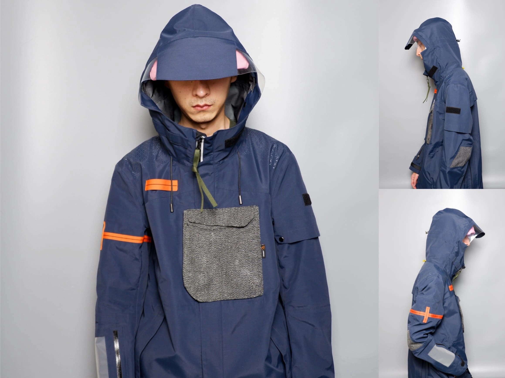 -->

作为一名对时尚，尤其是衣服也非常感兴趣的前端工程师，我从来没有停止过对既时尚又实用还舒适的衣服的追求。在众人印象里，程序员就是千篇一律的格式衫加双肩包，典型的刻板印象，但其实我们程序员还是非常注重自身形象的。说起双肩包，还不是因为程序员外出经常需要带电脑，还要带钥匙、钱包、数据线、充电宝之类的杂物，总不能用手拿着，身上的口袋也不够。由于双肩包体积过大，在人多的地方会影响正常行走，如果碰上下雨，且双肩包不防水的话，那里边的东西就全遭殃了。

<!-- truncate -->

:::caution

注意：这篇文章中有推广链接，对你的阅读体验并没有影响，不过如果你通过链接购买了商品，那么会帮助 UP 主恰饭，以支持 UP 创作更多优质的内容。谢谢支持🍙！

:::

记得在国外的时候，看到过有专门面向不同职业的服装品牌，它们结合特定人群的需求，推出了极具功用性且兼具时尚的衣服，所以我就找了下国内是否有这样的品牌。一个偶然的机会在 36 氪上看到了 UPPERVOID，看描述是专注于互联网人生活方式的品牌，瞬间感觉自己受到了重视。这个品牌推出了 C 系列机能服，号称是来自于未来世界：想象一下在未来机械化的世界里，每个人都需要携带战术装备和防护用具，随时应对危机，这样的场面让人感觉到既神秘又危险，而 C 系列机能服则提前把这种体验带到了我们当前的生活中，并把之前提到的问题全部解决了。

## 规格

C 系列机能服有 C、C+ 和 C++ 三种，可以想像跟手机一样有低、中、高配，它其实是冲锋衣的一种，但是更适合程序员的上班和通勤。因为我入手了 C+ 款，所以重点看一下 C+ 有哪些配置。（全文中的配图大部分为实拍，小部分来自品牌方）。

### 包装

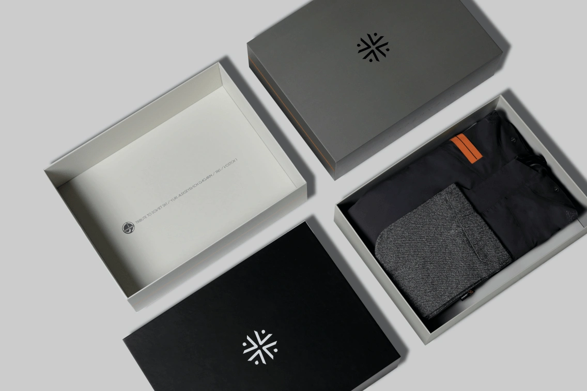

### 颜色尺码

C+ 机能服有三种颜色及多种尺码，可以参考下图：

UP 主身高 183，体重不到 60，穿的 M 码，合身。

购买链接（手机复制淘口令，电脑可直接点击链接打开）：

5.0￥LXdjcvL5y2v￥👉氵匋包👈 [https://m.tb.cn/h.4j8OkBW](https://m.tb.cn/h.4j8OkBW)【UPPERVOID冲锋衣C+多方系统全功能机能服多口袋防水保暖外套】

或使用淘宝客户端扫描二维码：

### 整体配置

- 面料：Voidtech Pro 三层复合面料
- 收纳位：10
- 特性：抗菌、免洗、防水、防火、防割
- 特殊配件：可充气颈枕、缓压眼罩、余光窗、背包遮罩

从配置上可以看到衣服提供了超多收纳口袋，以及特殊的特性和配件，接下来分别看一下它们解决了哪些实际问题。

## 解决收纳问题，摆脱双肩包

这款衣服的设计基于包豪思（Bauhaus）理念，以简洁为主且强调功能性，科技界的产品有很多受此主义影响，例如苹果。由于主打功能性，在我刚拿到这款 C+ 机能服的时候，看到上边遍布的口袋和拉链瞬间觉得有点不知所措，不过作为一名具有极客精神的程序员，那就结合“官方文档” 开始研究吧！口袋整体分布图如下：

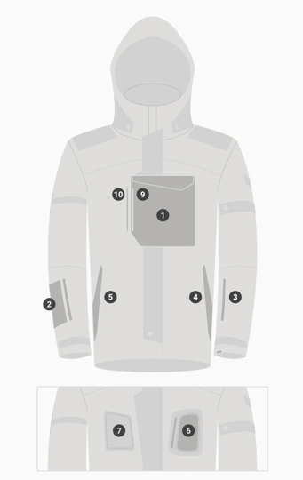

这衣服最显眼的地方应该就是胸前这个灰色的 1 号口袋，它叫作机械心，其实它最主要的作用并不是收纳，在后边再介绍它的特色。

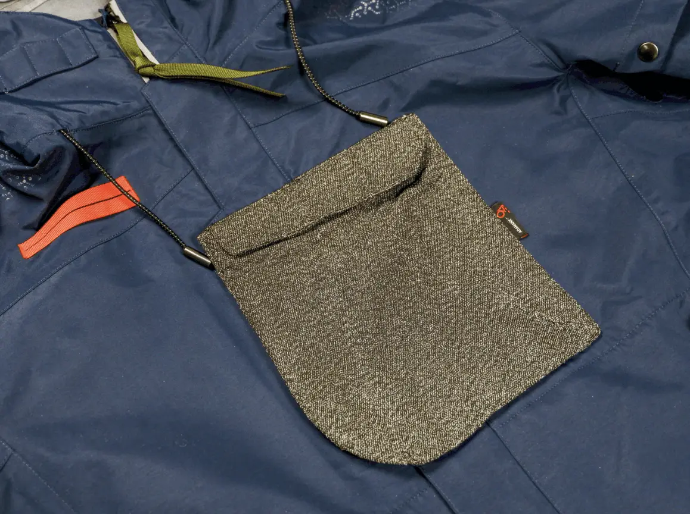

先看平时抄兜用的口袋 4 和 5，刚开始手放进去的时候觉得哪里不对，感觉空间很大，好像是漏的？再仔细一番摸索似乎两边都有尽头，原来这俩口袋是双向的，这样的设计在内部增大了空间，不过在拿东西的时候要注意前后都找一找，不要以为丢了。口袋的入口有拉链，遮罩也是前向的，可以防盗，拉链的底部也有暗扣，多上一层保险。

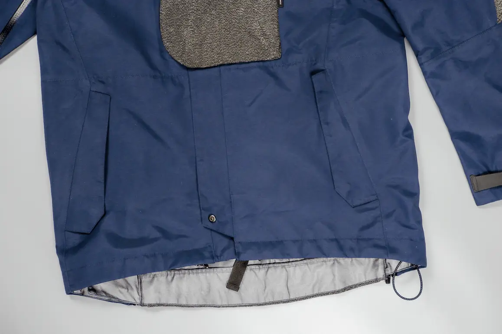

再来看袖子上的口袋，两边的有些不一样。右手边的 2 号口袋是透明的，叫工牌窗，里边可以放工牌等彰显身份的证件，比如你是阿里、腾讯、网易的员工，把工牌放到工牌窗里，在玩手机的时候就能不经意间炫耀一下，同时在打卡的时候也只需要抬下手，无需从口袋里拿出来或者从脖子里扯出来。

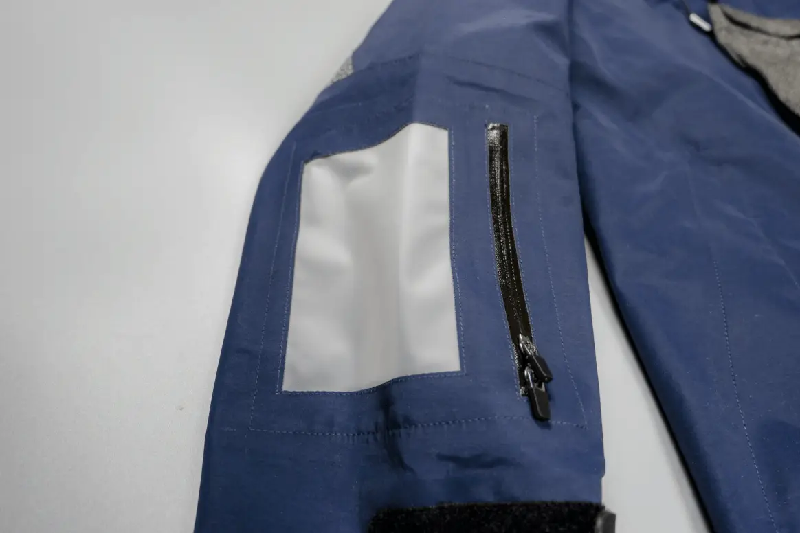

左手边的 3 号口袋有一点特别，除了袖子表面上的拉链入口外，在内部还有一个魔术贴入口。它的用处是，在只有左手是空闲时，想要从这个口袋中快速拿出物品，可以直接用左手解开魔术贴，里边的东西就能直接滑出来，非常适合放手机，而且这个口袋的设计就像是刺客抽取暗器的地方，非常酷炫。不过要注意魔术贴两边不是密封的，所以不能放小东西，否则会滑落。

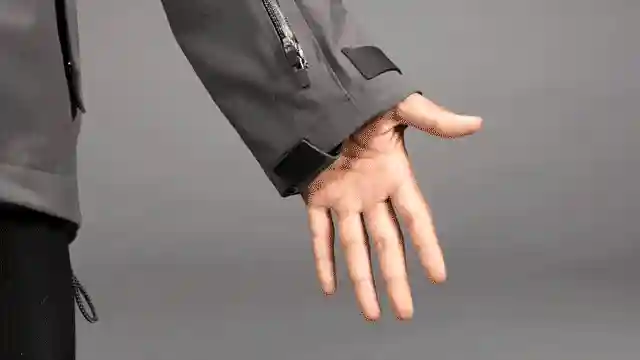

再来看衣服的后背部，在稍微靠上一点的位置还有一个大的口袋，叫 DEEPVOID，可以放笔记本、平板电脑一类较大的物品，C+系列试了放 10.9 寸的 iPad Air 完全没问题，最大可以放下苹果的 15 寸笔记本。这个口袋的重量可以分散在全身，所以不会累到肩膀。

上边帽子右下侧有磁石耳机收纳，随着真无线耳机的出现（例如苹果的无线耳机），无线耳机最后的一条连接线也去掉了，只剩了两只跟孤独的蝌蚪一样的耳机，如果不放到收纳盒会非常容易丢失，而这里的磁石耳机收纳可以完美解决这个问题。由于我没有无线耳机，就拿 Apple Pencil 测试了一下，吸力还是很强的。

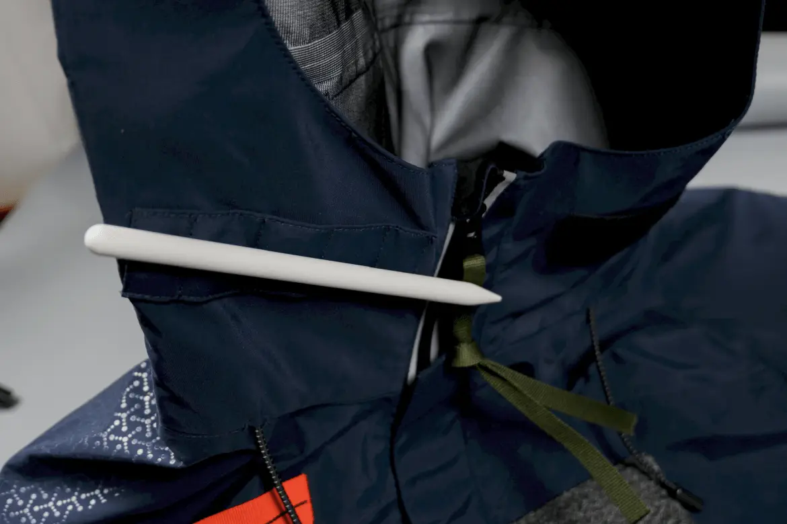

除了这些口袋之外，机械心下方有一隐藏口袋（9 号）、右侧有胸前口袋（10 号），衣服内部还有两个内口袋（6 号和 7 号），这些都可以根据自己的需求放置合适的物品。

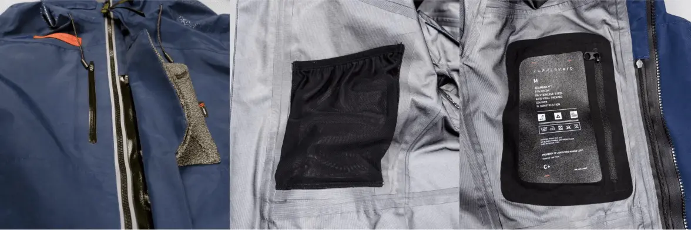

## **人性化设计，应对恶劣环境**

接下来说说这款衣服的重点部分，因为创始人是以用户为中心、以功用性为目标的，所以这款衣服有着十分贴心和人性化的设计。

### 透气

我们知道普通的冲锋衣为了防水防风会做到密不透风，这就影响了皮肤的呼吸和排汗。C+ 机能服则安排了通风设计，在后背处留有网状暗窗用于排气：

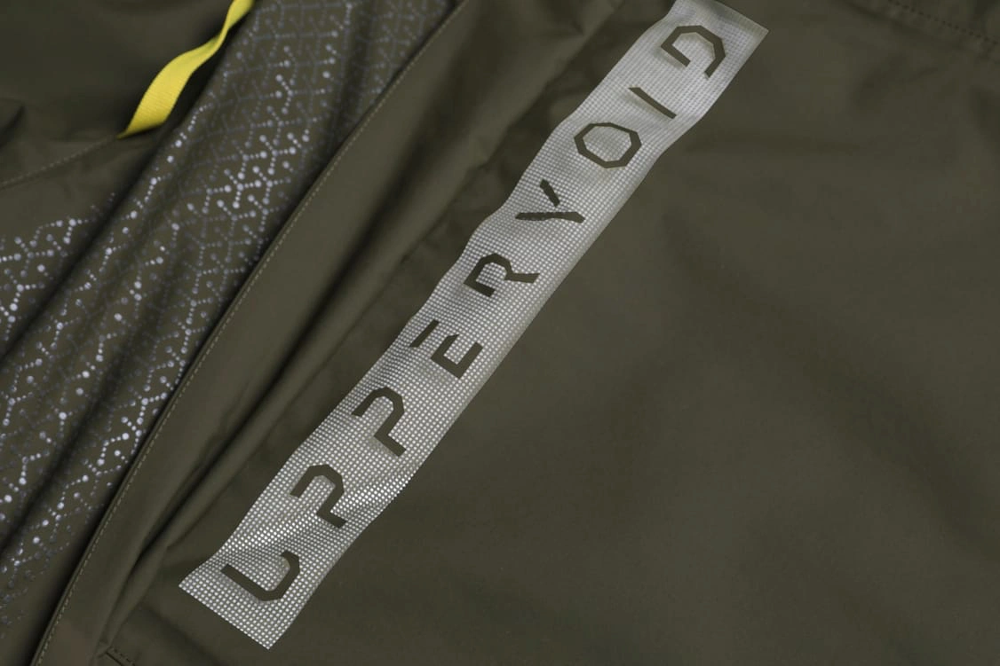

在腋下则有拉链可以直接打开进行散热。这两个部位是男生最爱出汗的地方，这样直接与外界通气之后能最大的发挥散热和排气作用。

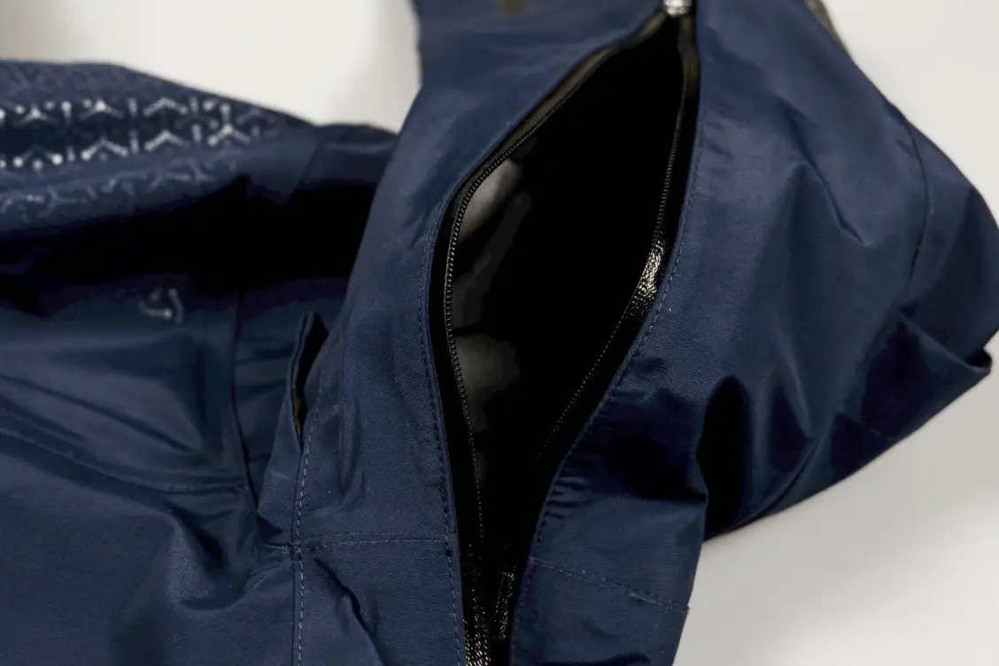

另外 C+ 机能服采用了 VOIDTECH PRO 三层复合面料，其中第二层微孔超薄透气 PU 膜的孔隙大于人体汗汽，所以整体上也是透气的，再加上第三层的 25D 柯特底布，能够避免如同穿着塑料袋的感受，进一步提高了舒适度。

### 防水

再来看防水性能，第二层的微孔超薄透气 PU 膜的孔隙虽然大于人体汗汽，但却小于水分子的直径，所以在透气的基础上还能够防水，结构如下：

> 人体汗汽<PU膜孔隙<水分子直径

我在拿到衣服之后，把它放到水龙头冲洗了近 5 分钟的时间，面料也没有湿，水流直接顺着衣服滑走了，想必下雨的时候也不怕忘带伞了。

而下雨天在需要戴帽子时，上边的余光窗也能增加视野，不必费力扭头去观察周围路况，帽檐的设计也可以让雨水更快滑走。

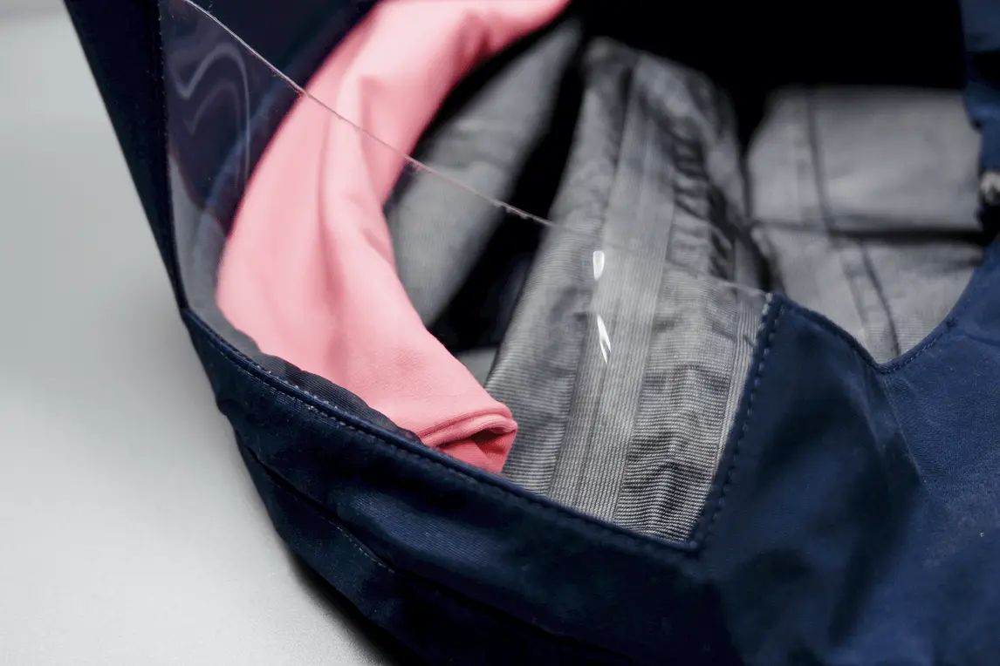

另外，如果必须要背双肩包时，遇到下雨天，可以利用 C+ 机能服的背包交互功能，防止淋湿。背包交互功能是衣服后背最下边的两条拉链，在拉开后可以增加后背空间，以容纳双肩包，这样利用衣服的防水性能，能够很好的保护包内物品。

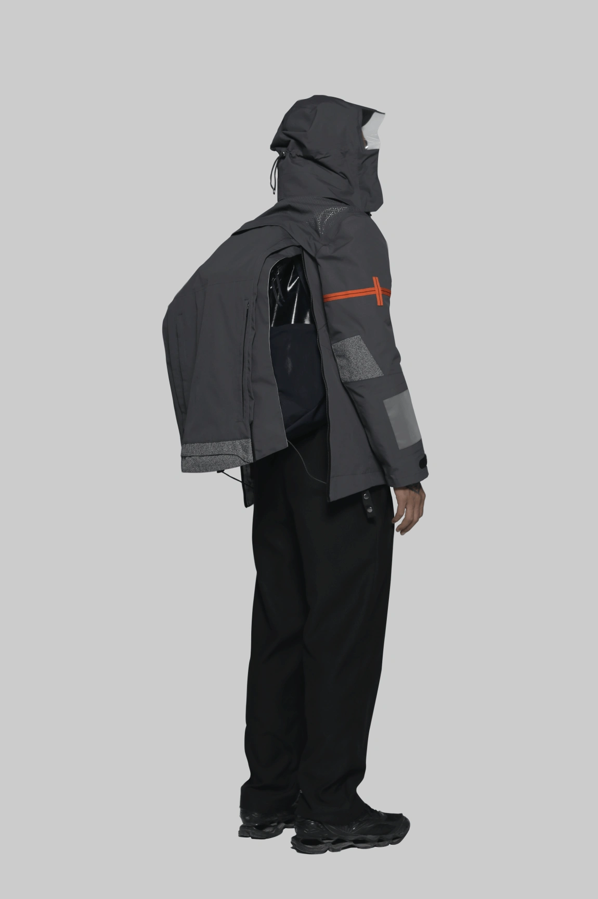

### 抗菌耐磨

C+ 机能服三层复合面料中的第一层，90D X 90D 超高纱密度面布，密度比市面上的冲锋衣高 3 倍，表面更加光滑，细菌和灰尘更不易附着，从而可以减少洗涤次数，甚至可以做到免洗的效果，想象一下把节省下来的水费和时间用到其它其它正事上，能提高多少效率。这种布料也极度耐磨，即使经常在户外极端环境下，或者室内办公桌的摩擦，都不会轻易造成衣服的磨损。

### 午睡福音

程序员由于脑力劳动较多、且时常加班到半夜，所以需要午睡来恢复能量，但是办公室的条件一般不适合午睡，多数人只是趴在桌子上将就，但是趴着睡的坏处很多：压迫眼球、肠胃和颈椎，睡醒之后还很可能会有一段时间会看不清眼前的东西，所以能仰睡最好就仰睡。C+ 机能服让我感到最贴心的是，它在领部有一个可充气的气囊，能够充当护颈枕的作用，这样无论是午睡还是休息，当靠在椅子上的时候，颈椎有了支撑会感到很舒服。

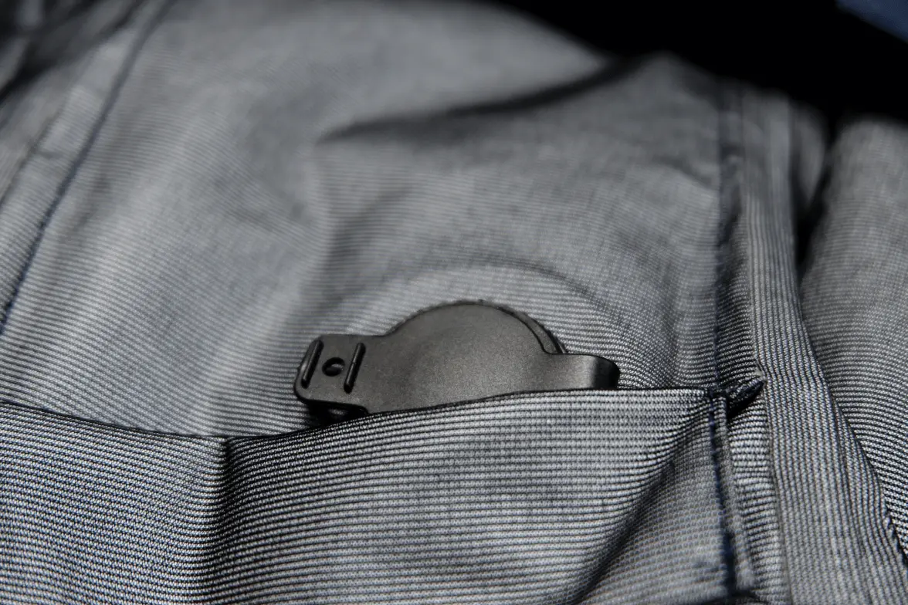

衣服的帽子上还有遮光眼罩，避免了光线对休息的影响，不要看它是粉嫩的颜色，据调查这个颜色能有效减缓心跳、脉搏和呼吸，从而帮助人们从焦虑的状态变为平静，它还有一个名字，叫做 P-618 粉。

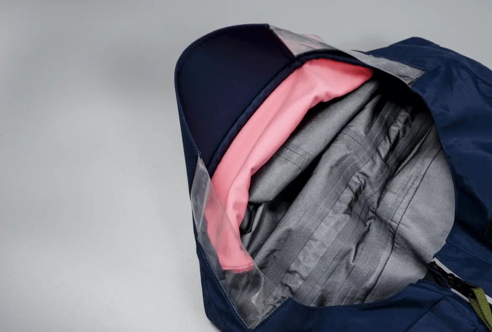

### 战术防护

现在来看一下胸前最显眼的口袋，机械心（MACHINEHEART），听这个名字就应该知道它大概的用途了。没错，它就是为了保护我们的心脏不被利器伤害。机械心的布料采用了浴火防割伤面料 ADAMANX，因为是军工级别的材料，因此成分不明。对于它的防割特性，一开始我也持怀疑态度，但是在实地拿锋利的刀片用力切割几次之后，面料仍然没有损坏，不愧是一套战术防护服！（注意：不防弹）。

## 时尚

时代的进步，让男生也越来越注重外表了，市面上的冲锋衣大多只注重功用而忽略了设计感，而 C+ 机能服在功能的基础上，添加了不少时尚细节，另外裁剪也适合亚洲人体型。衣服整体是机能风，因为面向的是未来机械时代的场景，经常逛淘宝的或者玩吃鸡的对这个风格应该并不陌生，以多口袋、立体有型、硬朗、暗色系为特色，给人增加神性感和威严感，提高整个人的气场和自信。

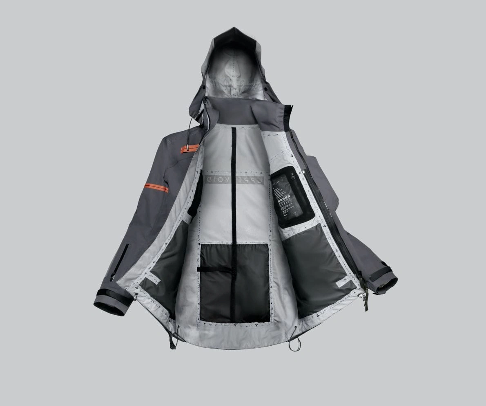

右侧袖标其实为品牌 LOGO，相当的低调，在暗色系中使用一点亮色给衣服增加了点缀装饰，且不浮夸。另外紧挨右侧袖子部分，有同样颜色的一块悬空的布带，可以悬挂一些能够悬挂的物品，例如签字笔等。

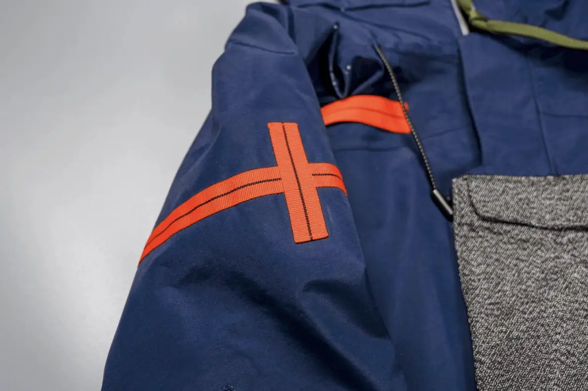

后背部也有暗花设计，除了增加质感外，还起到了防滑的作用，如果同时背了双肩包可以防止滑落。

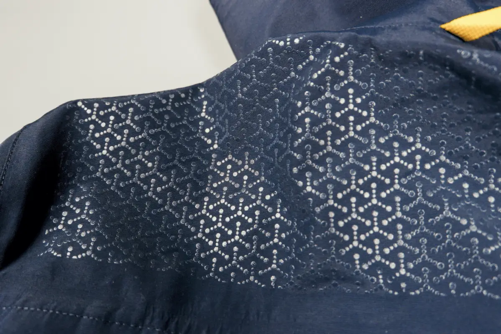

胸前的机械心的设计其实有一些突兀，跟朋友看过之后也有人也这么认为，虽然功能上很特别，但是我个人认为可以把它隐藏在内部，然后在原本的位置设计成更优雅一些的元素。

## 价格与保修

C+ 机能服的定价是 1499，C 是 899，C++ 为 2499。综合上边的特点，这款衣服的耐用程度几乎可以一辈子只入手一件（或者穿到腻了为止- -），再加上“世纪保修”服务，只要是非人为损坏的自然磨损都提供保修服务，时限为 100 年。

## 上身实拍

（为了装酷极力避免露脸- -）

## 关于品牌方

品牌 UPPERVOID，创始人为 Vis，毕业于沃顿商学院，坚持理性逻辑和艺术审美应当结合起来，这一点与本 UP 主的理念保持一致。在体验过诸如喜马拉雅、北极圈之类的极端环境之后，Vis 认为应该将防护作为生存之根本，加上对科技从业者的敬佩，于是就有了 UPPERVOID，专门为互联网从业人士打造的生活方式品牌。通过把最新的科技融入到生活中，把未来机械世界的场景提前带入到了日常生活中来，让我们体验到技术究竟会引领大家到何方。这款机能服是 UPPERVOID 的第一个产品，从面料、功能和设计上来看已经完全可以看到未来高科技生活的影子了。

## 购买方式

购买链接（手机复制淘口令，电脑可直接点击链接打开）：

5.0￥LXdjcvL5y2v￥👉氵匋包👈 [https://m.tb.cn/h.4j8OkBW](https://m.tb.cn/h.4j8OkBW)【UPPERVOID冲锋衣C+多方系统全功能机能服多口袋防水保暖外套】

或使用淘宝客户端扫描二维码：

## 总结

在拿到衣服以前，我对它还是持谨慎态度，因为我个人处事比较小心，但是在收到衣服之后，发现跟产品介绍中的丝毫不差，在认真研究各部分的结构和功能之后，我对它们开始逐一测试，从口袋的作用、防水性能、透气性能、防刀割性能上都一一作了测试，结果可以说是超出预期，让我打破了以往衣服只是为了遮蔽和时尚的用途。 在上身实装试了效果之后，我感觉总体从功能和设计上都很满意，值得入手。另外，这是件有学习曲线的衣服，本文并未介绍全部功能和特性，如果你打算入手，可以对它的各项功能特色进行测试，以便更好的体验到这件衣服的独特之处。对于这件承载着对未来世界憧憬的机能服，你有什么看法呢？欢迎给品牌方反馈。
