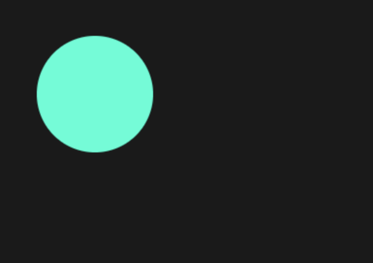
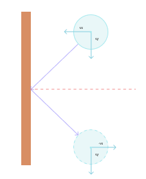
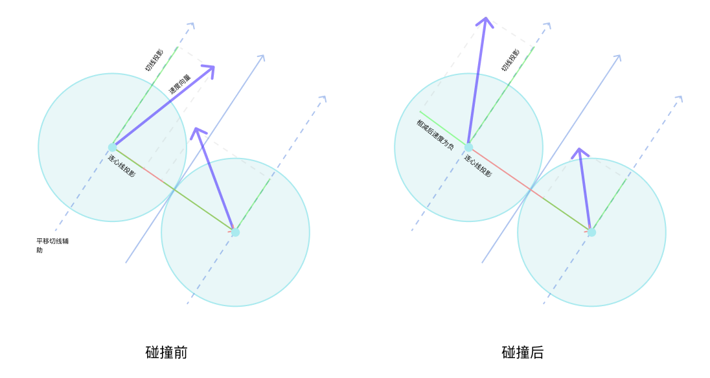

年前我看到合成大西瓜小游戏火了，想到之前从来没有研究过游戏方面的开发，这次就想趁着这个机会看看 JavaScript 游戏开发，从原生角度上如何实现游戏里的物理特性，例如运动、碰撞。虽然之前研究过物理相关的动画库，但是我打算试试不用框架编写一个简单的 JavaScript 物理引擎，实现小球的碰撞效果。

为什么不用现成的游戏库呢？因为我觉得在了解底层的实现原理之后，才能更有效的理解框架上的概念和使用方法，在解决 BUG 的时候能够更有效率，同时对自己的编码技能也是一种提升。在对 JavaScript 物理引擎的研究过程中，发现写代码是次要的，最主要的是理解相关的物理、数学公式和概念，虽然我是理科生，但是数学和物理从来不是我的强项，我不是把知识还给老师了，而是压根就没掌握过 ^o^。过年期间花了有小半个月的时间在学习物理知识，现在仍然对某些概念和推导过程没有太大的自信，不过最后还算是做出了一个简单的、比较满意的结果，见下图。

<!-- truncate -->

<Video src={require("./img/javascript-collision-physics/01-gravity.mp4").default} />

接下来看一下怎么实现这样的效果。

## 基础结构

我们这里使用 canvas 来实现 JavaScript 物理引擎。首先准备项目的基础文件和样式，新建一个 index.html、index.js 和 style.css 文件，分别用于编写 canvas 的 html 结构、引擎代码和画布样式。

在 index.html 的 `<head />` 标签中引入样式文件：

```html
<link rel="stylesheet" href="./style.css" />
```

在 `<body />` 中，添加 canvas 元素、加载 index.js 文件：

```html
<main>
  <canvas id="gameboard"></canvas>
</main>
<script src="./index.js"></script>
```

这段代码定义了 `id` 为 `gameboard` 的 `<canvas />` 元素，并放在了 `<main />` 元素下， `<main />` 元素主要是用来设置背景色和画布大小。在 `<main/>` 元素的下方引入 index.js 文件，这样可以在 DOM 加载完成之后再执行 JS 中的代码。

style.css 中的代码如下：

```css
* {
  box-sizing: border-box;
  padding: 0;
  margin: 0;
  font-family: sans-serif;
}

main {
  width: 100vw;
  height: 100vh;
  background: hsl(0deg, 0%, 10%);
}
```

样式很简单，去掉所有元素的外边距、内间距，并把 `<main/>` 元素的宽高设置为与浏览器可视区域相同，背景色为深灰色。

> hsl(hue, saturation, brightness) 为 css 颜色表示法之一，参数分别为色相，饱和度和亮度，可通过我[之前出过的视频](https://www.bilibili.com/video/BV1E64y1Z79Q/)进行学习。

## 绘制小球

接下来绘制小球，主要用到了 canvas 相关的 api。

在 index.js 中，编写如下代码：

```javascript
const canvas = document.getElementById("gameboard");
const ctx = canvas.getContext("2d");

canvas.width = window.innerWidth;
canvas.height = window.innerHeight;

let width = canvas.width;
let height = canvas.height;

ctx.fillStyle = "hsl(170, 100%, 50%)";
ctx.beginPath();
ctx.arc(100, 100, 60, 0, 2 * Math.PI);
ctx.fill();
```

代码中主要利用了二维 context 进行绘图操作：

- 通过 canvas 的 id 获取 canvas 元素对象。
- 通过 canvas 元素对象获取绘图 context， `getContext()` 需要一个参数，用于表明是绘制 2d 图像，还是使用 webgl 绘制 3d 图象，这里选择 2d。context 就类似是一支画笔，可以改变它的颜色和绘制基本的形状。
- 给 canvas 的宽高设置为浏览器可视区域的宽高，并保存到 `width` 和 `height` 变量中方便后续使用。
- 给 context 设置颜色，然后调用 `beginPath()` 开始绘图。
- 使用 `arc()` 方法绘制圆形，它接收 5 个参数，前两个为圆心的 x、y 坐标，第 3 个为半径长度， 第 4 个和第 5 个分别是起始角度和结束角度，因为 `arc()` 其实是用来绘制一段圆弧，这里让它画一段 0 到 360 度的圆弧，就形成了一个圆形。这里的角度是使用 radian 形式表示的，0 到 360 度可以用 0 到 2 * Math.PI 来表示。
- 最后使用 `ctx.fill()` 给圆形填上颜色。

这样就成功的绘制了一个圆形，我们在这把它当作一个小球：



## 移动小球

不过，这个时候的小球还是静止的，如果想让它移动，那么得修改它的圆心坐标，具体修改的数值则与运动速度有关。在移动小球之前，先看一下 canvas 进行动画的原理：

Canvas 进行动画的原理与传统的电影胶片类似，在一段时间内，绘制图像、更新图像位置或形状、清除画布，重新绘制图像，当在 1 秒内连续执行 60 次或以上这样的操作时，即以 60 帧的速度，就可以产生连续的画面。

那么在 JavaScript 中，浏览器提供了 `window.requestAnimationFrame()` 方法，它接收一个回调函数作为参数，每一次执行回调函数就相当于 1 帧动画，我们需要通过递归或循环连续调用它，浏览器会尽可能的在 1 秒内执行 60 次回调函数。那么利用它，我们就可以对 canvas 进行重绘，以实现小球的移动效果。

> 由于 `window.requestAnimationFrame()` 的调用基本是持续进行的，所以我们也可以把它称为游戏循环（Game loop）。

接下来我们来看如何编写动画的基础结构：

```javascript
function process() {
  window.requestAnimationFrame(process);
}
window.requestAnimationFrame(process);
```

这里的 `process()` 函数就是 1 秒钟要执行 60 次的回调函数，每次执行完毕后继续调用 `window.requestAnimationFrame(process)`进行下一次循环。如果要移动小球，那么就需要把绘制小球和修改圆心 x、y 坐标的代码写到 `process()` 函数中。

为了方便更新坐标，我们把小球的圆心坐标保存到变量中，以方便对它们进行修改，然后再定义两个新的变量，分别表示在 x 轴方向上的速度 `vx`，和 y 轴方向上的速度 `vy`，然后把 context 相关的绘图操作放到 `process()` 中：

```javascript
let x = 100;
let y = 100;
let vx = 12;
let vy = 25;

function process() {
  ctx.fillStyle = "hsl(170, 100%, 50%)";
  ctx.beginPath();
  ctx.arc(x, y, 60, 0, 2 * Math.PI);
  ctx.fill();
  window.requestAnimationFrame(process);
}
window.requestAnimationFrame(process);
```

要计算圆心坐标 x、y 的移动距离，我们需要速度和时间，速度这里有了， 那么时间要怎么获取呢？ `window.requestAnimationFrame()` 会把当前时间的毫秒数（即时间戳）传递给回调函数，我们可以把本次调用的时间戳保存起来，然后在下一次调用时计算出执行这 1 帧动画消耗了多少秒，然后根据这个秒数和 x、y 轴方向上的速度去计算移动距离，分别加到 x 和 y 上，以获得最新的位置。注意这里的时间是上一次函数调用和本次函数调用的时间间隔，并不是第 1 次函数调用到当前函数调用总共过去了多少秒，所以相当于是时间增量，需要在之前 x 和 y 的值的基础上进行相加，代码如下：

```javascript
let startTime;

function process(now) {
  if (!startTime) {
    startTime = now;
  }
  let seconds = (now - startTime) / 1000;
  startTime = now;

  // 更新位置
  x += vx * seconds;
  y += vy * seconds;

  // 清除画布
  ctx.clearRect(0, 0, width, height);
  // 绘制小球
  ctx.fillStyle = "hsl(170, 100%, 50%)";
  ctx.beginPath();
  ctx.arc(x, y, 60, 0, 2 * Math.PI);
  ctx.fill();

  window.requestAnimationFrame(process);
}
```

`process()` 现在接收当前时间戳作为参数，然后做了下面这些操作：

- 计算上次函数调用与本次函数调用的时间间隔，以秒计，记录本次调用的时间戳用于下一次计算。
- 根据 x、y 方向上的速度，和刚刚计算出来的时间，计算出移动距离。
- 调用 `clearRect()` 清除矩形区域画布，这里的参数，前两个是左上角坐标，后两个是宽高，把 canvas 的宽高传进去就会把整个画布清除。
- 重新绘制小球。

现在小球就可以移动了：

<Video src={require("./img/javascript-collision-physics/03-moving-ball.mp4").default} />

## 重构代码

上边的代码适合只有一个小球的情况，如果有多个小球需要绘制，就得编写大量重复的代码，这时我们可以把小球抽象成一个类，里边有绘图、更新位置等操作，还有坐标、速度、半径等属性，重构后的代码如下：

```javascript
class Circle {
  constructor(context, x, y, r, vx, vy) {
    this.context = context;
    this.x = x;
    this.y = y;
    this.r = r;
    this.vx = vx;
    this.vy = vy;
  }
  
    // 绘制小球
  draw() {
    this.context.fillStyle = "hsl(170, 100%, 50%)";
    this.context.beginPath();
    this.context.arc(this.x, this.y, this.r, 0, 2 * Math.PI);
    this.context.fill();
  }

  /**
   * 更新画布
   * @param {number} seconds
   */
  update(seconds) {
    this.x += this.vx * seconds;
    this.y += this.vy * seconds;
  }
}
```

里边的代码跟之前的一样，这里就不再赘述了，需要注意的是，Circle 类的 context 画笔属性是通过构造函数传递进来的，更新位置的代码放到了 `update()` 方法中。

对于整个 canvas 的绘制过程，也可以抽象成一个类，当作是游戏或引擎控制器，例如把它放到一个叫 `Gameboard` 的类中：

```javascript
class Gameboard {
  constructor() {
    this.startTime;
    this.init();
  }

  init() {
    this.circles = [
      new Circle(ctx, 100, 100, 60, 12, 25),
      new Circle(ctx, 180, 180, 30, 70, 45),
    ];
    window.requestAnimationFrame(this.process.bind(this));
  }

  process(now) {
    if (!this.startTime) {
      this.startTime = now;
    }
    let seconds = (now - this.startTime) / 1000;
    this.startTime = now;

    for (let i = 0; i < this.circles.length; i++) {
      this.circles[i].update(seconds);
    }
    ctx.clearRect(0, 0, width, height);

    for (let i = 0; i < this.circles.length; i++) {
      this.circles[i].draw(ctx);
    }
    window.requestAnimationFrame(this.process.bind(this));
  }
}

new Gameboard();
```

在 Gameboard 类中：

- `startTime` 保存了上次函数执行的时间戳的属性，放到了构造函数中。
- `init()` 方法创建了一个 `circles` 数组，里边放了两个示例的小球，这里先不涉及碰撞问题。然后调用 `window.requestAnimationFrame()` 开启动画。注意这里使用了 `bind()` 来把 `Gameboard` 的 this 绑定到回调函数中，以便于访问 `Gameboard` 中的方法和属性。
- `process()` 方法也写到了这里边，每次执行时会遍历小球数组，对每个小球进行位置更新，然后清除画布，再重新绘制每个小球。
- 最后初始化 `Gameboard` 对象就可以开始执行动画了。

这个时候有两个小球在移动了。

<Video src={require("./img/javascript-collision-physics/04-two-moving-balls.mp4").default} />

## 碰撞检测

为了实现仿真的物理特性，多个物体间碰撞会有相应的反应，第一步就是要先检测碰撞。我们先再多加几个小球，以便于碰撞的发生，在 Gameboard 类的 `init()` 方法中再添加几个小球：

```javascript
this.circles = [
  new Circle(ctx, 30, 50, 30, -100, 390),
  new Circle(ctx, 60, 180, 20, 180, -275),
  new Circle(ctx, 120, 100, 60, 120, 262),
  new Circle(ctx, 150, 180, 10, -130, 138),
  new Circle(ctx, 190, 210, 10, 138, -280),
  new Circle(ctx, 220, 240, 10, 142, 350),
  new Circle(ctx, 100, 260, 10, 135, -460),
  new Circle(ctx, 120, 285, 10, -165, 370),
  new Circle(ctx, 140, 290, 10, 125, 230),
  new Circle(ctx, 160, 380, 10, -175, -180),
  new Circle(ctx, 180, 310, 10, 115, 440),
  new Circle(ctx, 100, 310, 10, -195, -325),
  new Circle(ctx, 60, 150, 10, -138, 420),
  new Circle(ctx, 70, 430, 45, 135, -230),
  new Circle(ctx, 250, 290, 40, -140, 335),
];
```

然后给小球添加一个碰撞状态，在碰撞时，给两个小球设置为不同的颜色：

```javascript
class Circle {
  constructor(context, x, y, r, vx, vy) {
    // 其它代码
    this.colliding = false;
  }
  draw() {
    this.context.fillStyle = this.colliding
      ? "hsl(300, 100%, 70%)"
      : "hsl(170, 100%, 50%)";
    // 其它代码
  }
}
```

现在来判断小球之间是否发生了碰撞，这个条件很简单，判断两个小球圆心的距离是否小于两个小球的半径之和就可以了，如果小于等于则发生了碰撞，大于则没有发生碰撞。圆心的距离即计算两个坐标点的距离，可以用公式：

$$
\sqrt{(x_1 - x_2)^2 + (y_1 - y_2)^2}
$$

x1、y1 和 x2、y2 分别两个小球的圆心坐标。在比较时，可以对半径和进行平方运算，进而省略对距离的开方运算，也就是可以用下方的公式进行比较：

$$
(x_1 - x_2)^2 + (y_1 - y_2)^2 \leq (r_1 + r_2)^2
$$

r1 和 r2 为两球的半径。

在 Circle 类中，先添加一个`isCircleCollided(other)`方法，接收另一个小球对象作为参数，返回比较结果：

```javascript
isCircleCollided(other) {
  let squareDistance =
      (this.x - other.x) * (this.x - other.x) +
      (this.y - other.y) * (this.y - other.y);
  let squareRadius = (this.r + other.r) * (this.r + other.r);
  return squareDistance <= squareRadius;
}
```

再添加 `checkCollideWith(other)` 方法，调用 `isCircleCollided(other)` 判断碰撞后，把两球的碰撞状态设置为 true：

```javascript
checkCollideWith(other) {
  if (this.isCircleCollided(other)) {
    this.colliding = true;
    other.colliding = true;
  }
}
```

接着我们需要使用双循环两两比对小球是否发生了碰撞，由于小球数组存放在 Gameboard 对象中，我们给它添加一个 `checkCollision()` 方法来检测碰撞：

```javascript
checkCollision() {
  // 重置碰撞状态
  this.circles.forEach((circle) => (circle.colliding = false));

  for (let i = 0; i < this.circles.length; i++) {
    for (let j = i + 1; j < this.circles.length; j++) {
      this.circles[i].checkCollideWith(this.circles[j]);
    }
  }
}
```

因为小球在碰撞后就应立即弹开，所以我们一开始要把所有小球的碰撞状态设置为 false，之后在循环中，对每个小球进行检测。这里注意到内层循环是从 i + 1 开始的，这是因为在判断 1 球和 2 球是否碰撞后，就无须再判断 2 球 和 1 球了。

之后在 `process()` 方法中，执行检测，注意检测应该发生在使用 for 循环更新小球位置的后边才准确：

```javascript
for (let i = 0; i < this.circles.length; i++) {
  this.circles[i].update(seconds);
}
this.checkCollision();
```

现在，可以看到小球在碰撞时，会改变颜色了。

<Video src={require("./img/javascript-collision-physics/05-collision-detect.mp4").default} />

## 边界碰撞

上边的代码在执行之后，小球都会穿过边界跑到外边去，那么我们先处理一下边界碰撞的问题。检测边界碰撞需要把四个面全部都处理到，根据圆心坐标和半径来判断是否和边界发生了碰撞。例如跟左边界发生碰撞时，圆心的 x 坐标是小于或等于半径长度的，而跟右边界发生碰撞时，圆心 x 坐标应该大于或等于画布最右侧坐标（即宽度值）减去半径的长度。上边界和下边界类似，只是使用圆心 y 坐标和画布的高度值。在水平方向上（即左右边界）发生碰撞时，小球的运动方向发生改变，只需要把垂直方向上的速度 vy 值取反即可，在垂直方向上碰撞则把 vx 取反。



现在看一下代码的实现，在 Gameboard 类中添加一个 `checkEdgeCollision()` 方法，根据上边描述的规则编写如下代码：

```javascript
checkEdgeCollision() {
  this.circles.forEach((circle) => {
    // 左右墙壁碰撞
    if (circle.x < circle.r) {
      circle.vx = -circle.vx;
      circle.x = circle.r;
    } else if (circle.x > width - circle.r) {
      circle.vx = -circle.vx;
      circle.x = width - circle.r;
    }

    // 上下墙壁碰撞
    if (circle.y < circle.r) {
      circle.vy = -circle.vy;
      circle.y = circle.r;
    } else if (circle.y > height - circle.r) {
      circle.vy = -circle.vy;
      circle.y = height - circle.r;
    }
  });
}
```

在代码中，碰撞时，除了对速度进行取反操作之外，还把小球的坐标修改为紧临边界，防止超出。接下来在 `process()` 中添加对边界碰撞的检测：

```javascript
this.checkEdgeCollision();
this.checkCollision();
```

这时候可以看到小球在碰到边界时，可以反弹了：

<Video src={require("./img/javascript-collision-physics/07-edge-collision.mp4").default} />

但是小球间的碰撞还没有处理，在处理之前，先复习一下向量的基本操作，数学好的同学可以直接跳过，只看相关的代码。

## 向量的基本操作

由于在碰撞时，需要对速度向量（或称为矢量）进行操作，向量是使用类似坐标的形式表示的，例如 < 3, 5 > (这里用 `<>` 表示向量)，它有长度和方向，对于它的运算有一定的规则，本教程中需要用到向量的加法、减法、乘法、点乘和标准化操作。

向量相加只需要把两个向量的 x 坐标和 y 坐标相加即可，例如：$<3, 5> + <1, 2> = <4, 7>$
减法与加法类似，把 x 坐标和 y 坐标相减，例如：$<3, 5> - <1, 2> = <2, 3>$

乘法，这里指的是向量和标量的乘法，标量指的就是普通的数字，结果是把 x 和 y 分别和标量相乘，例如：$3\times<3, 5> = <9, 15>$。

点乘是两个向量相乘的一种方式，类似的还有叉乘，但是在本示例中用不到，点乘其实计算的是一个向量在另一个向量上的投影，它的计算方式为两个向量的 x 的积加上 y 的积，它返回的是一个标量，即第 1 个向量在第 2 个向量上投影的长度，例如：$<3, 5> \cdot <1, 2> = 3 \times 1 + 5 \times 2 = 13$

标准化是除掉向量的长度，只剩下方向，这样的向量它的长度为 1，称为单位向量，标准化的过程是让 x 和 y 分别除以向量的长度，因为向量表示的是和原点(0, 0)的距离，所以可以直接使用 $\sqrt{(x^2 + y^2)}$ 计算长度，例如 < 3, 4 > 标准化后的结果为：$<3, 5> \cdot <1, 2> = 3 \times 1 + 5 \times 2 = 13$。

了解了向量的基本运算后，我们来创建一个 Vector 工具类，来方便我们进行向量的运算，它的代码就是实现了这些运算规则：

```javascript
class Vector {
  constructor(x, y) {
    this.x = x;
    this.y = y;
  }

  /**
   * 向量加法
   * @param {Vector} v
   */
  add(v) {
    return new Vector(this.x + v.x, this.y + v.y);
  }

  /**
   * 向量减法
   * @param {Vector} v
   */
  substract(v) {
    return new Vector(this.x - v.x, this.y - v.y);
  }

  /**
   * 向量与标量乘法
   * @param {Vector} s
   */
  multiply(s) {
    return new Vector(this.x * s, this.y * s);
  }

  /**
   * 向量与向量点乘（投影）
   * @param {Vector} v
   */
  dot(v) {
    return this.x * v.x + this.y * v.y;
  }

  /**
   * 向量标准化（除去长度）
   * @param {number} distance
   */
  normalize() {
    let distance = Math.sqrt(this.x * this.x + this.y * this.y);
    return new Vector(this.x / distance, this.y / distance);
  }
}
```

代码中没有什么特殊的语法和操作，这里就不再赘述了，接下来我们看一下小球的碰撞问题。

## 碰撞处理

碰撞处理最主要的部分就是计算碰撞后的速度和方向。通常最简单的碰撞问题是在同一个水平面上的两个物体的碰撞，称为一维碰撞，因为此时只需要计算同一方向上的速度，而我们现在的程序小球是在一个二维平面内运动的，小球之间发生正面相碰（即在同一运动方向）的概率很小，大部分是斜碰（在不同运动方向上擦肩相碰），需要同时计算水平和垂直方向上的速度和方向，这就属于是二维碰撞问题。不过，其实小球之间的碰撞，只有在连心线（两个圆心的连线）上有作用力，而在碰撞接触的切线方向上没有作用力，那么我们只需要知道连心线方向的速度变化就可以了，这样就转换成了一维碰撞。



计算碰撞后的速度时，遵守动量守恒定律和动能守恒定律，公式分别为：

##### 动量守恒定律

$$
m_1v_1 + m_2v_2 = m_1v_1' + m_2v_2'
$$

##### 动能守恒定律
$$
\frac{1}{2}m_1v_1^2+\frac{1}{2}m_2v_2^2=\frac{1}{2}m_1v_1'^2+\frac{1}{2}m_2v_2'^2
$$

m1、m2 分别为两小球的质量，v1 和 v2 为两小球碰撞前的速度向量，v1' 和 v2' 为碰撞后的速度向量。根据这两个公式可以推导出两小球碰撞后的速度公式：

$$
v_1'=\frac{v_1(m_1-m_2)+2m_2v_2}{m_1+m_2}
$$

$$
v_2'=\frac{v_2(m_2-m_1)+2m_1v_1}{m_1+m_2}
$$


如果不考虑小球的质量，或质量相同，其实就是两小球速度互换，即：

$$
v_1'=v_2
$$

$$
v_2'=v_1
$$

这里我们给小球加上质量，然后套用公式来计算小球碰撞后速度，先在 Circle 类中给小球加上质量 mass 属性：

```javascript
class Circle {
  constructor(context, x, y, r, vx, vy, mass = 1) {
    // 其它代码
    this.mass = mass;
  }
}
```

然后在 Gameboard 类的初始化小球处，给每个小球添加质量：

```javascript
this.circles = [
  new Circle(ctx, 30, 50, 30, -100, 390, 30),
  new Circle(ctx, 60, 180, 20, 180, -275, 20),
  new Circle(ctx, 120, 100, 60, 120, 262, 100),
  new Circle(ctx, 150, 180, 10, -130, 138, 10),
  new Circle(ctx, 190, 210, 10, 138, -280, 10),
  new Circle(ctx, 220, 240, 10, 142, 350, 10),
  new Circle(ctx, 100, 260, 10, 135, -460, 10),
  new Circle(ctx, 120, 285, 10, -165, 370, 10),
  new Circle(ctx, 140, 290, 10, 125, 230, 10),
  new Circle(ctx, 160, 380, 10, -175, -180, 10),
  new Circle(ctx, 180, 310, 10, 115, 440, 10),
  new Circle(ctx, 100, 310, 10, -195, -325, 10),
  new Circle(ctx, 60, 150, 10, -138, 420, 10),
  new Circle(ctx, 70, 430, 45, 135, -230, 45),
  new Circle(ctx, 250, 290, 40, -140, 335, 40),
];
```

在 Circle 类中加上 `changeVelocityAndDirection(other)` 方法来计算碰撞后的速度，它接收另一个小球对象作为参数，同时计算这两个小球碰撞厚的速度和方向，这个是整个引擎的核心，我们一点一点的来看它是如何实现的。首先把两个小球的速度使用 Vector 向量来表示：

```javascript
  changeVelocityAndDirection(other) {
    // 创建两小球的速度向量
    let velocity1 = new Vector(this.vx, this.vy);
    let velocity2 = new Vector(other.vx, other.vy);
  }
```

因为我们本身就已经使用 vx 和 vy 来表示水平和垂直方向上的速度向量了，所以直接把它们传给 Vector 的构造函数就可以了。`velocity1` 和 `velocity2` 分别代表当前小球和碰撞小球的速度向量。

接下来获取连心线方向的向量，也就是两个圆心坐标的差：

```javascript
let vNorm = new Vector(this.x - other.x, this.y - other.y);
```

接下来获取连心线方向的单位向量和切线方向上的单位向量，这些单位向量代表的是连心线和切线的方向：

```javascript
let unitVNorm = vNorm.normalize();
let unitVTan = new Vector(-unitVNorm.y, unitVNorm.x);
```

`unitVNorm` 是连心线方向单位向量，`unitVTan` 是切线方向单位向量，切线方向其实就是把连心线向量的 x、y 坐标互换，并把 y 坐标取反。根据这两个单位向量，使用点乘计算小球速度在这两个方向上的投影：

```javascript
let v1n = velocity1.dot(unitVNorm);
let v1t = velocity1.dot(unitVTan);

let v2n = velocity2.dot(unitVNorm);
let v2t = velocity2.dot(unitVTan);
```

计算结果是一个标量，也就是没有方向的速度值。`v1n` 和 `v1t` 表示当前小球在连心线和切线方向的速度值，`v2n` 和 `v2t` 则表示的是碰撞小球 的速度值。在计算出两小球的速度值之后，我们就有了碰撞后的速度公式所需要的变量值了，直接用代码把公式套用进去：

```javascript
let v1nAfter = (v1n * (this.mass - other.mass) + 2 * other.mass * v2n) / (this.mass + other.mass);
let v2nAfter = (v2n * (other.mass - this.mass) + 2 * this.mass * v1n) / (this.mass + other.mass);
```

`v1nAfter` 和 `v2nAfter` 分别是两小球碰撞后的速度，现在可以先判断一下，如果 `v1nAfter` 小于 `v2nAfter`，那么第 1 个小球和第 2 个小球会越来越远，此时不用处理碰撞：

```javascript
if (v1nAfter < v2nAfter) {
  return;
}
```

然后再给碰撞后的速度加上方向，计算在连心线方向和切线方向上的速度，只需要让速度标量跟连心线单位向量和切线单位向量相乘：

```javascript
let v1VectorNorm = unitVNorm.multiply(v1nAfter);
let v1VectorTan = unitVTan.multiply(v1t);

let v2VectorNorm = unitVNorm.multiply(v2nAfter);
let v2VectorTan = unitVTan.multiply(v2t);
```

这样有了两个小球连心线上的新速度向量和切线方向上的新速度向量，最后把连心线上的速度向量和切线方向的速度向量进行加法操作，就能获得碰撞后小球的速度向量：

```javascript
let velocity1After = v1VectorNorm.add(v1VectorTan);
let velocity2After = v2VectorNorm.add(v2VectorTan);
```

之后我们把向量中的 x 和 y 分别还原到小球的 vx 和 vy 属性中：

```javascript
this.vx = velocity1After.x;
this.vy = velocity1After.y;

other.vx = velocity2After.x;
other.vy = velocity2After.y;
```

最后在 `checkCollideWith()` 方法的 if 语句中调用此方法，即在检测到碰撞时：

```javascript
checkCollideWith(other) {
  if (this.isCircleCollided(other)) {
    this.colliding = true;
    other.colliding = true;
    this.changeVelocityAndDirection(other); // 在这里调用
  }
}
```

这时，小球的碰撞效果就实现了。

<Video src={require("./img/javascript-collision-physics/09-ball-collision.mp4").default} />

## 非弹性碰撞

现在小球之间的碰撞属于完全弹性碰撞，即碰撞之后不会有能量损失，这样小球永远不会停止运动，我们可以让小球在碰撞之后损失一点能量，来模拟更真实的物理效果。要让小球碰撞后有能量损失，可以使用恢复系数，它是一个取值范围为 0 到 1 的数值，每次碰撞后，乘以它就可以减慢速度，如果恢复系数为 1 则为完全弹性碰撞，为 0 则是完全非弹性碰撞，之间的数值为非弹性碰撞，现实生活中的碰撞都是非弹性碰撞。

先看一下边界碰撞，这个比较简单，假设边界的恢复系数为 0.8，然后在每次对速度取反的时候乘以它就可以了，把 Gameboard `checkEdgeCollision() `方法作如下改动：

```javascript
  checkEdgeCollision() {
    const cor = 0.8;                  // 设置恢复系统
    this.circles.forEach((circle) => {
      // 左右墙壁碰撞
      if (circle.x < circle.r) {
        circle.vx = -circle.vx * cor; // 加上恢复系数
        circle.x = circle.r;
      } else if (circle.x > width - circle.r) {
        circle.vx = -circle.vx * cor; // 加上恢复系数
        circle.x = width - circle.r;
      }

      // 上下墙壁碰撞
      if (circle.y < circle.r) {
        circle.vy = -circle.vy * cor; // 加上恢复系数
        circle.y = circle.r;
      } else if (circle.y > height - circle.r) {
        circle.vy = -circle.vy * cor; // 加上恢复系数
        circle.y = height - circle.r;
      }
    });
  }
```

接下来设置小球的恢复系数，给 Circle 类再加上一个恢复系数 cor 属性，每个小球可以设置不同的数值，来让它们有不同的弹性，然后在初始化小球时设置随意的恢复系数：

```javascript
class Circle {
  constructor(context, x, y, r, vx, vy, mass = 1, cor = 1) {
    // 其它代码
    this.cor = cor;
  }
}

class Gameboard {
  init() {
   this.circles = [
      new Circle(ctx, 30, 50, 30, -100, 390, 30, 0.7),
      new Circle(ctx, 60, 180, 20, 180, -275, 20, 0.7),
      new Circle(ctx, 120, 100, 60, 120, 262, 100, 0.3),
      new Circle(ctx, 150, 180, 10, -130, 138, 10, 0.7),
      new Circle(ctx, 190, 210, 10, 138, -280, 10, 0.7),
      new Circle(ctx, 220, 240, 10, 142, 350, 10, 0.7),
      new Circle(ctx, 100, 260, 10, 135, -460, 10, 0.7),
      new Circle(ctx, 120, 285, 10, -165, 370, 10, 0.7),
      new Circle(ctx, 140, 290, 10, 125, 230, 10, 0.7),
      new Circle(ctx, 160, 380, 10, -175, -180, 10, 0.7),
      new Circle(ctx, 180, 310, 10, 115, 440, 10, 0.7),
      new Circle(ctx, 100, 310, 10, -195, -325, 10, 0.7),
      new Circle(ctx, 60, 150, 10, -138, 420, 10, 0.7),
      new Circle(ctx, 70, 430, 45, 135, -230, 45, 0.7),
      new Circle(ctx, 250, 290, 40, -140, 335, 40, 0.7),
    ];
  }
}
```

加上恢复系数之后，小球碰撞后的速度计算也需要改变一下，可以简单的让 `v1nAfter` 和 `v2nAfter` 乘以小球的恢复系数，也可以使用带有恢复系数的速度公式（这两种方式我暂时还不太清楚区别，有兴趣的小伙伴可以自己研究一下），公式如下：

$$
v_1'=\frac{m_1v_1+m_2v_2+m2C_R(v_2-v_1)}{m_1+m_2}
$$

$$
v_2'=\frac{m_1v_1+m_2v_2+m1C_R(v_1-v_2)}{m_1+m2}
$$

接着把公式转换为代码，在 Circle 类的 `changeVelocityAndDirection()` 方法中，替换掉 `v1nAfter` 和 `v2nAfter` 的计算公式：

```javascript
let cor = Math.min(this.cor, other.cor);
let v1nAfter =
    (this.mass * v1n + other.mass * v2n + cor * other.mass * (v2n - v1n)) /
    (this.mass + other.mass);

let v2nAfter =
    (this.mass * v1n + other.mass * v2n + cor * this.mass * (v1n - v2n)) /
    (this.mass + other.mass);
```

这里要注意的是两小球碰撞时的恢复系数应取两者的最小值，按照常识，弹性小的无论是去撞别人还是别人撞它，都会有同样的效果。现在小球碰撞后速度会有所减慢，不过还差一点，我们可以加上重力来让小球自然下落。

<Video src={require("./img/javascript-collision-physics/10-coefficient-of-restitution.mp4").default} />

## 重力

添加重力比较简单，先在全局定义重力加速度常量，然后在小球更新垂直方向上的速度时，累计重力加速度就可以了：

```javascript
const gravity = 980;

class Circle {
  update(seconds) {
    this.vy += gravity * seconds; // 重力加速度
    this.x += this.vx * seconds;
    this.y += this.vy * seconds;
  }
}
```

重力加速度大约是 $9.8m/s^2$，但是由于我们的画布是以象素为单位的，所以使用 9.8 看起来会像是没有重力，或者像是从很远的地方观察小球，这时候可以把重力加速度放大一定倍数来达到更逼真的效果。

<Video src={require("./img/javascript-collision-physics/01-gravity.mp4").default} />

## 总结

现在我们这个简单的 JavaScript 物理引擎就完成了，实现了物理引擎最基本的部分，可以有一个完整的掉落和碰撞的效果，要做一个更逼真的物理引擎还需要考虑更多的因素和更复杂的公式，例如考虑一下摩擦力、空气阻力、碰撞后的旋转角度等，并且这个 canvas 的帧率也会有一定的问题，如果有的小球速度过快，但是如果来不及执行下一次回调函数更新它的位置，那么它可能就直接穿过碰撞的小球到另一边了。

来总结一下开发过程：

- 使用 context 绘制小球。
- 搭建 Canvas 动画基础结构，主要使用 `window.requestAnimationFrame`方法反复执行回调函数。
- 移动小球，通过小球的速度和函数执行时的时间戳来计算移动距离。
- 碰撞检测，通过比对两个小球的距离和它们半径的和。
- 边界碰撞的检测和方向改变。
- 小球之间的碰撞，应用速度公式和向量操作计算出碰撞后的速度和方向。
- 利用恢复系数实现非弹性碰撞。
- 添加重力效果。

代码可以在以下地址中查看：

[https://github.com/zxuqian/html-css-examples/tree/master/35-collision-physics](https://github.com/zxuqian/html-css-examples/tree/master/35-collision-physics)

希望这篇文章对你有所帮助，如果文章中的代码、公式或表述有不正确的地方，请留言指正，感谢阅读！

import Video from "@site/src/components/Video";