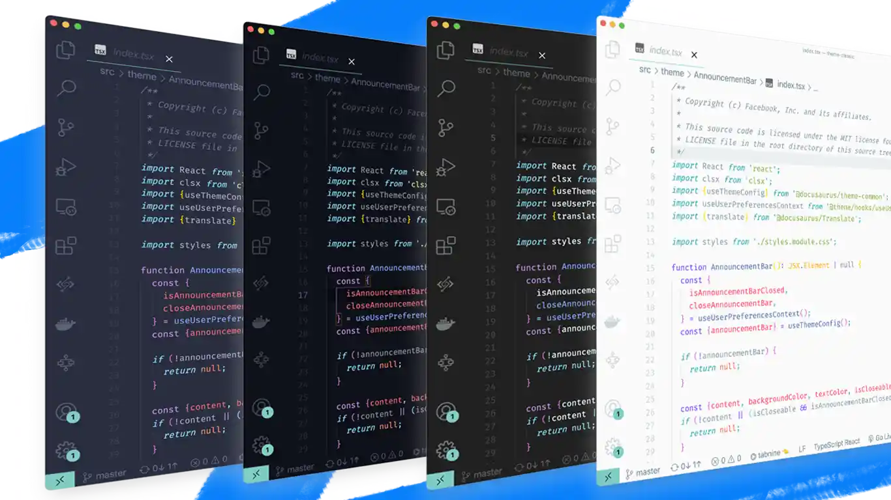
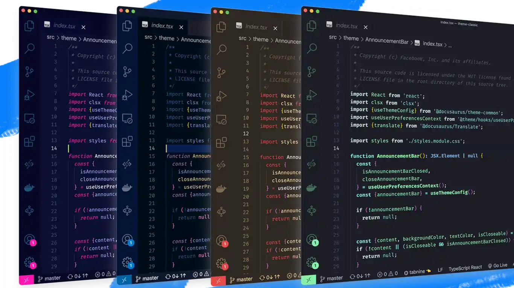
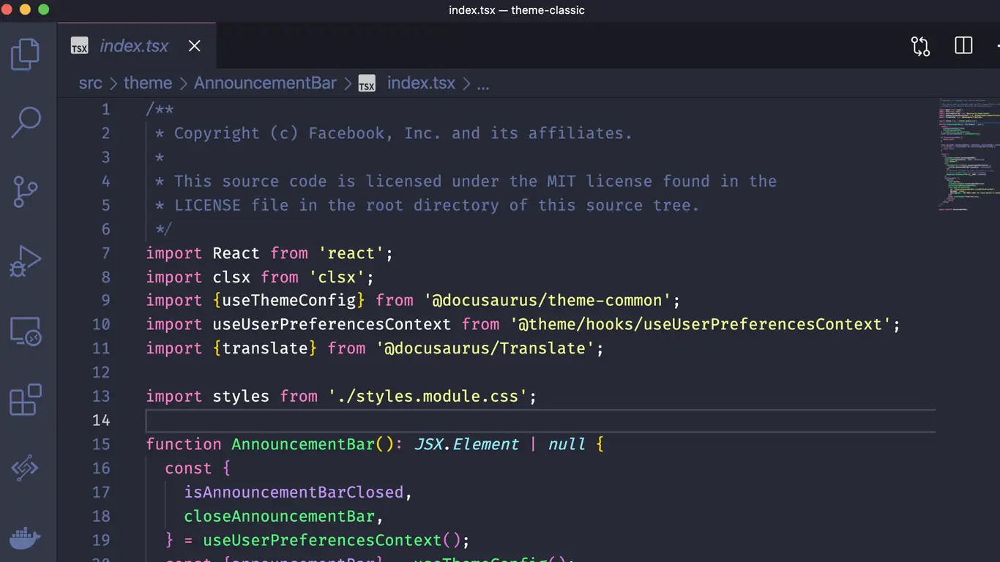
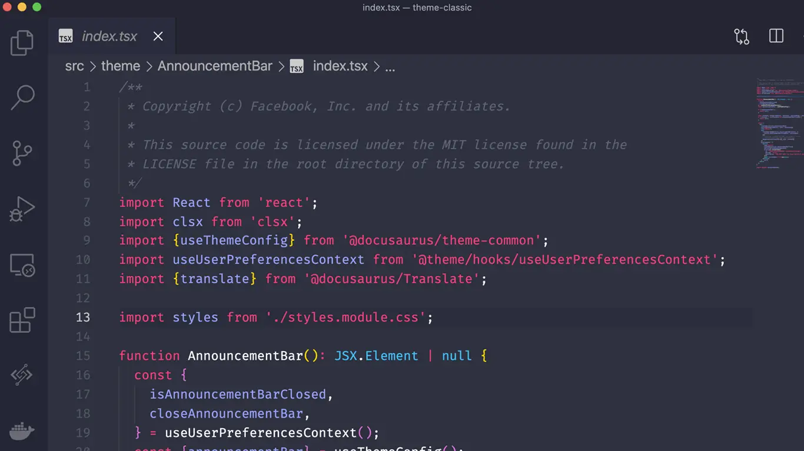

在 B 站发布视频这么久，收到最多的问题就是 VS Code 用的主题是什么？我之前都一一回复了，但是总是单独回复很没效率~这里就把我在用的主题整理了一下，一定有你在视频里看中的那一款，如果没有那肯定是有 bug~。

## VS Code 更换主题的方式

在介绍主题之前，先看一下怎么在 VS Code 中切换主题。VS Code 提供了便捷的快捷命令面板，里边各种常用的主题都可以搜索到，包括更换主题。打开快捷命令面板的快捷键是：

 **Command / Ctrl + shift + p**

在顶部弹出的快捷命令面板输入框中输入 color，这里假设你也是使用的英文版的 VS Code，然后在自动补全提示框中选择 Preferences: Color theme，之后在按回车就会看到可以选择的主题了，分为浅色版和深色版两部分，一个主题通常会包含多款不同颜色的变种，你可以通过上下键选择并预览。

下边来介绍主题。

## [Material Theme](https://github.com/material-theme/vsc-material-theme)

[Material Theme](https://github.com/material-theme/vsc-material-theme) 是我经常使用的主题，分为原版和社区版，不过我并没发现有什么区别。它包括 palenight、ocean、darker 等主题，并且还有对应的高对比度版。

## [1984](https://github.com/juanmnl/vs-1984)

[1984](https://github.com/juanmnl/vs-1984) 是一款赛博朋克风的主题，里边包含 Cyberpunk、funcy、Orweillian 等子主题，**我现在在用的是 Cyberpunk 这一款**，整体颜色为单一绿色，很有极客风，而且文字的颜色也有渐变效果，特别酷，这款也是 1984 中唯一适合长期使用的，其他的对眼睛不太友好（作者亲自说明）。

## [Dracula Official](https://github.com/dracula/visual-studio-code)

[Dracula](https://github.com/dracula/visual-studio-code) 是在各种 IDE 环境下都非常有名的主题，可以说是深色主题的佼佼者，我第一次在用 VS Code 的时候就是用的这款主题。

## [Hydra Theme for VS-Code](https://github.com/juanmnl/vs-hydra)

[Hydra](https://github.com/juanmnl/vs-hydra) 是 1984 主题作者推荐的护眼主题，在 1984 Cyberpunk 出题出现之前，我试了试这一款，感觉跟 Material Theme 的 palenight 类似，也是很优雅的主题。

## [One Monokai Theme](https://github.com/azemoh/vscode-one-monokai)

[One Monokai Theme](https://github.com/azemoh/vscode-one-monokai) 是 Monokai 和 One Dark 主题的合体，这两个颜色色系一般是用在代码高亮中的，做成主题感觉也就那样。