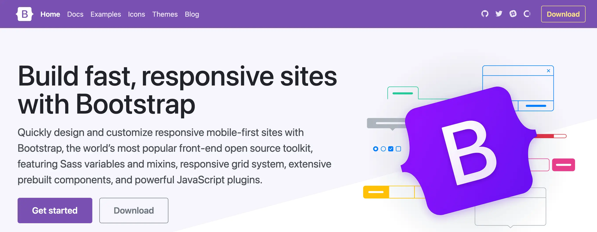
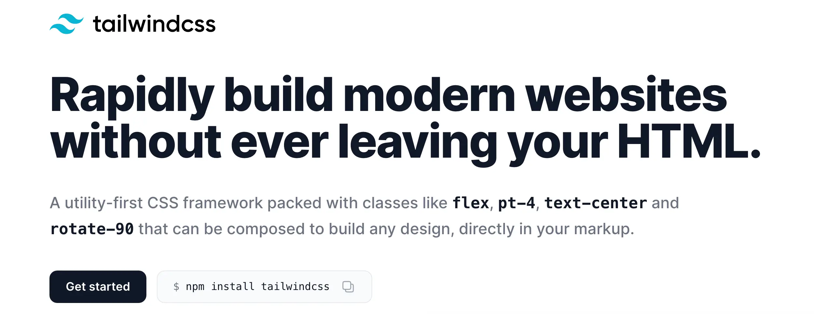
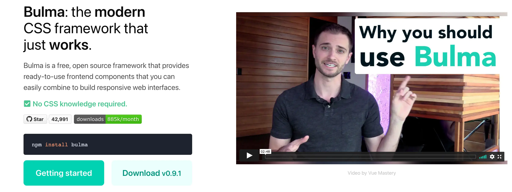
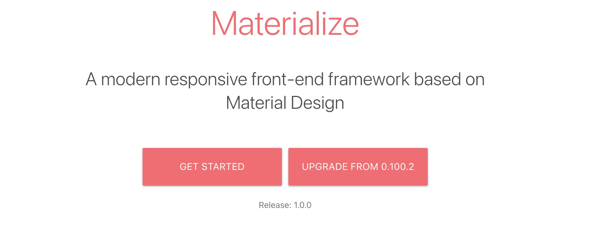
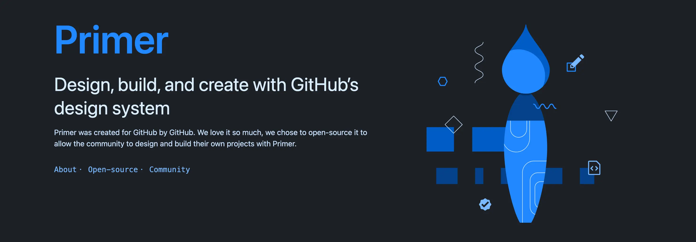
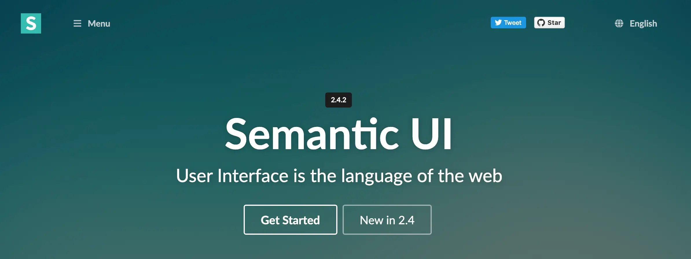

最近几年的前端发展越来越快，已经单独成为了一种职业。CSS 框架作为前端界比较有争议的工具，在很早之前就已经存在了，而且发展到现在仍然有用武之地。

无论是初级还是高级前端工程师，多多少少都会使用到 CSS 框架。初级工程师可以利用它们快速的编写原型界面，高级前端工程师则利用特殊的 CSS 框架来编写复杂的 UI 界面。

这篇文章收集了前端工程师最常用的 CSS 框架，并介绍它们的特点、优点和缺点，以方便你进行选择。

## 为什么使用 CSS 框架

在正式介绍 CSS 框架之前，先了解一下为什么要使用 CSS 框架，它们在当今的前端开发中有什么作用。

- 大部分 CSS 框架都提供了常见的 UI 样式，例如选项卡、卡片、按钮、导航等，可以直接复制粘贴示例代码来快速的给自己的页面加上这些组件。

- 使用 CSS 框架可以省略大部分 CSS 样式的编写，直接使用框架提供的 class 名字，在 HTML 中引用就可以了。

- 在编写大型网站时，CSS 样式难以维护，我们通常在不同页面加载同一个 CSS 文件，如果命名冲突，就会导致样式有问题。如果编码习惯不好，还会造成大量的重复代码。

如果想要更快速、更有效率的编写网站，并且使得代码更容易维护、更清晰，那么可以选择下边任意一个框架。


## Bootstrap

[](https://getbootstrap.com/)

[Bootstrap](https://getbootstrap.com/) 算是最老牌的 CSS 框架了，自 2011 年 Twitter 公司开源了此项目以来，到目前 2021 年已经近 10 年了。它是为了解决跨浏览器兼容性问题和响应式网站设计的问题而产生的，一度成为最火爆的前端框架。

现在 Bootstrap 已经发展成为一个通用的、完整的 CSS 框架了，内置了丰富的 UI 组件和交互功能，来促进前端工程师的生产力。不过，火爆的背后一定也会有负面的评价，那么 Boostrap 的优缺点有哪些呢？

### 优点

那么 BootStrap 有哪些优点呢？

- 庞大的生态。Boostrap 经过的多年的发展，几乎是创业公司的不二之选，伴随着这种热门程度的结果就是 Boostrap 构建了强大的社区，而社区的贡献者时刻都在贡献着与 Boostrap 相关的主题、组件和插件。基本上网站开发的各种需求都有对应的解决方案。
- 丰富的内置组件库。Bootstrap 包括页面布局、导航、按钮、Tab 选项卡、表格、表单、列表等各种常用的组件，能够最大限度的节省开发的时间。
- 快速开发原型。借助 Bootstrap 内置的组件和样式，可以用很短的时间搭建一个基本可用的原型出来，无需关心 CSS 或 JavaScript，因为组件都是现成的，可以拿来即用。
- 较低的学习曲线。通过阅读 Bootstrap 文档以及网络上各路大牛的文章，可以很快就上手 Bootstrap 开发网站。

### 缺点

当然，Bootstrap 火爆的背后，也暴露的不少的缺点。

- 重复性。因为大量的公司和团队使用 Bootstrap 作为产品起步原型，导致了很多产品的样式都是相似的，之间没有任何辨识度，在浏览这些不同公司的网站时，感觉都是一个模子里刻出来的。
- 性能问题。Bootstrap 内置了大量的组件，就必然导致了需要加载大量的 js 和 css 代码，这样可能会影响网站的加载速度。
- 扩展困难。使用 Bootstrap 虽然能进行快速开发，但是由于内置组件的样式和 HTML 代码关联性很强，所以要自定义它们的样式也很烦琐。
## Tailwind

[](https://tailwindcss.com/)

[Tailwind CSS](https://tailwindcss.com/) 是前端框架中的后起之秀，属于工具类的框架，它不提供任何 HTML 组件，只是单纯的把常见的一些样式定义成可复用的 css class，这样开发者可以自由的编写 HTML 结构，在需要调整样式时，只需要使用 Tailwind 提供的 class 就能快速完成，省去了编写 CSS 的过程。Tailwind CSS 可以与 Vue 开发进行紧密、良好的结合。使用 Tailwind CSS 编写的代码类似是这样的：

```html
<ul class="space-y-4">
  <li>
    <div class="w-64 h-3 bg-gradient-to-br from-fuchsia-500 to-purple-600"></div>
  </li>
  <li>
    <div class="w-56 h-3 bg-gradient-to-br from-fuchsia-500 to-purple-600"></div>
  </li>
  <li>
    <div class="w-48 h-3 bg-gradient-to-br from-fuchsia-500 to-purple-600"></div>
  </li>
  <li>
    <div class="w-40 h-3 bg-gradient-to-br from-fuchsia-500 to-purple-600"></div>
  </li>
  </li>
</ul>

```

### 优点

Tailwind 的优点有：

- 高效。在编写 HTML 的同时就可以应用样式，省去了 HTML/CSS 之间反复进行切换的烦恼。
- 可扩展。因为不限制 HTML 代码，所以可以自由编写任何 HTML 结构，并且可以完全控制元素的样式、覆盖 Tailwind CSS 内置的样式。

### 缺点

Tailwind 的缺点有：

- HTML 元素中可能会有大量的 Tailwind 内置的 class，使得代码变得难以阅读。
- 高级前端工程师可能并不需要这样的工具类库，而是选择手写 CSS。
## Bulma

[](https://bulma.io/)

[Bulma](https://bulma.io/) 是一款纯 CSS 的框架，没有任何 JavaScript 代码，所以可以很方便的在 React、Vue 等前端框架中引入。Bulma 提供了简单、美观、易用的内置组件库，只需要编写少量的 HTML 代码，然后通过 css class 指定组件就可以快速完成编写。

### 优点

Bulma 的优点有：

- 高度可定制。通过覆盖内置的 CSS 变量就能创建自定义的主题。
- 提供工具类。就像 Tailwind CSS 一样，在基础组件的基础上，提供了工具类来快速的调整样式。
- 易于阅读。bulma 提供的 css class 名称十分简洁，符合自然语义。

### 缺点

Bulma 的缺点有：

- Bulma 可能相对于 Bootstrap 来说是一个相对较新的框架，所以生态和社区上稍有不足。

## Materialize

[](https://materializecss.com/)

[Materialize](https://materializecss.com/) 是随着 Google Material Design 的兴起而出现的前端 CSS 框架。它与 Bootstrap 的功能类似，也提供了大量的内置组件，不过都是遵循的 Google Material Design 的设计规范，所以在样式上与 Bootstrap 完全不同。

### 优点

Materialize 的优点有：

- 提升开发效率。Materialize 把 Material Design 的颜色、动画、阴影等固定的样式都整合在了内置组件中，开发者无需关心是否符合 Material Design，可以使用 Materialize 提供的内置组件进行快速开发。
- 易于上手。简单的语法、实用的文档让开发者能够快速上手，尤其是对于有 Bootstrap 开发经验的来说更为容易。

### 缺点

Materialize 的缺点有：

- Materialize 有大量的 JavaScript API，要完全掌握它们可能需要一些时间和经验。

## MDUI

[](https://www.mdui.org/)

[MDUI](https://www.mdui.org/) 与 Materialize 框架类似，都是实现了谷歌的 Material Design 规范，也提供了比较丰富的内置组件库。

### 优点

MDUI 的优点有：

- 中文文档。MDUI 是国人编写的框架，所以有良好的、易于阅读的中文文档，可以快速入门。
- 主题多。MDUI 内置了多种主题，且替换方便。

### 缺点

MDUI 的缺点有：

- MDUI 的内置组件库和 JavaScript 组件可能不如 Materialize 丰富，但是仍在完善和更新中。

## Foundation

[](https://get.foundation/)

[Foundation](https://get.foundation/) 是一个老牌的前端框架了，号称是世界上最先进的框架。使用它能开发出响应式的、跨平台的、良好的可访问性的网站。Foundation 最大的特点就是高度可定制，不仅仅是作为网页的开发框架，还能作为电子邮件页面的开发框架。

### 优点

Foundation 的优点有：

- 独特性。由于 Foundation 可以高度定制，所以做出来的网站有很强的独特性。
- 覆盖面广。对于常见的 UI 操作进行了封装，例如折叠、流畅滚动、粘滞等功能。

### 缺点

Foundation 的缺点有：

- Foundation 因为更加灵活，所以学习曲线相对于其他框架来说，也比较陡峭。

## Primer

[](https://primer.style/)

[Primer CSS](https://primer.style/) 是对 Github 设计系统的 CSS 实现。设计系统值得是一个产品需要遵守的一些设计规范、样式规范和行为规范等，例如颜色的选择、间距的大小、尺寸、不同组件之间的组合等等。Primer 是 Github 设计系统的名称，而 Primer CSS 只是它的实现部分，它提供了大量的内置组件和工具类，在快速开发原型的基础上，也能对其进行自定义。

### 优点

Primer 的优点有：

- 设计美观。Primer CSS 的设计相对于其他框架来说比较潮流，可以用内置的基础组件就能做出漂亮的页面。
- 可定制。Primer CSS 中使用了大量的变量来定义颜色、字体、间距等，可以通过覆盖进行定制。
- 

### 缺点

Primer 的缺点有：

- 由于 Primer CSS 遵循了 Primer 的设计系统，所以可能熟悉了此设计系统才更容易理解 Primer 的组件和工具类，上手可能相对困难一些。
## Semantic UI

[](https://semantic-ui.com/)

[Semantic UI](https://semantic-ui.com/) 是与 Boostrap 十分相似的框架，主打语义化的 css class 名称，强调 UI 即为 Web 的语言。

### 优点

Semantic UI 的优点有：
- 以自然语言进行命名的 css class，就像使用英语进行编程。
- 有丰富的主题和组件库。
- 简单易学，如果有 Bootstrap 基础，那么上手 Semantic UI 很容易。

### 缺点

- 这家框架似乎已经停止维护了，最后一次更新还在两三年前。