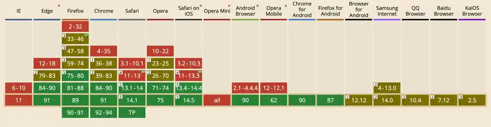

import BVideo from "@site/src/components/BVideo";

<BVideo src="//player.bilibili.com/player.html?aid=248712851&bvid=BV1Vv411W7zY&cid=356473306&page=1"/>

我们常用的、给页面元素添加动画的方式之一是，使用 CSS Keyframes，通过百分比来控制属性值的变化，从而产生动画效果，但是这样有个缺点，就是 keyframes 是静态的，里边的属性值不能动态的设置，并且也没有办法暂停或改变动画的执行过程：

```javascript
@keyframes FadeAndMove {
  %0 {
    opacity: 0;
    transform: translateY(-20px);
  }
  100% {
    opacity: 1;
    transform: translateY(0px);
  }
}
```

而如果用 JavaScript 操作 style 属性又会导致动画执行效率低下，浏览器需要频繁刷新图层，那么针对这种情况，浏览器规范中出现了 Web Animations API，它算是 CSS Keyframes 动画底层的渲染机制，所以执行效率与 CSS 动画一样。这个 API 已经存在很多年了，但是一直在优化改进中，它的定义动画的语法与 css keyframes 类似，并且调用方式和 jquery 也类似，上手用起来很容易。

## 示例

我们来看一个例子，我们定义一个标题和一个副标题：

- 标题文字动画为，渐隐渐现并向下移动的效果。
- 副标题动画为，扩展和渐隐渐现的效果，只有在鼠标点击的时候才会执行，并且只动画执行一次，动画的执行时间是标题动画的一半。

<Codepen title="JS 原生高性能的动画实现：Web Animations API" hash="XWMzvLV" />

## 编写 HTML

我们先来看 HTML 结构，很简单，就是一个 class 为 container 的容器，里边放着 h1 表示的标题，class 为 title，h2 表示的副标题，class 为 subtitle。

```html
<main>
  <div class="container">
    <h1 class="title">Welcome</h1>
    <h2 class="subtitle">JavaScript Web Animations API</h2>
  </div>
</main>
```

## 编写 CSS

CSS 里主要就是用 main 元素把整体布局进行居中，然后设置了一下文字居中对齐、文字颜色和大小：

```css
.container {
  text-align: center;
}

h1 {
  font-size: 72px;
  color: white;
}

h2 {
  color: hsl(0deg, 0%, 80%);
  font-size: 18px;
  margin-top: 18px;
}
```

## 标题渐隐渐现和移动动画

我们先来看一下标题渐隐渐现并向下移动的动画，首先在 JS 里获取标题元素：

```javascript
let title = document.querySelector(".title");
```

接着定义 keyframes，Web Animations API 中的 keyframes 是用包含一组对象的数组来表示的，每个对象是由要进行动画的 CSS 属性和值构成的，每个对象会平分执行时间，一般至少需要两个对象，一个表示开始，一个表示结束。我们这里定义了一个 `fadeAndMove` keyframes，让透明度从 0 过渡到 1，位置从 -20px 过渡到 0px：

```javascript
let fadeAndMove = [
  {
    opacity: 0,
    transform: `translateY(-20px)`,
  },
  {
    opacity: 1,
    transform: `translateY(0px)`,
  },
];
```

这里要注意的是，如果 CSS 属性有连字符，需要写成驼峰形式，例如 "background-color" -> "backgroundColor"。
有了 Keyframes，还需要定义动画执行时间，和执行函数，分别用 duration 和 easing 属性来表示，这里定义了 `titleTiming`  对象，动画执行时间为 2 秒，注意这里是使用毫秒数定义的，不像是 CSS 中用秒定义时间，然后 easing 动画执行函数设置为 "ease-in-out"，如果不设置，默认就是 "linear"，线性的：

```javascript
let titleTiming = {
  duration: 2000,
  easing: "ease-in-out",
};
```

有了 Keyframes、执行时间和函数之后，就可以执行动画了。执行动画可以使用 DOM 元素的 animate() 方法，第 1 个参数接收 Keyframe 数组，第 2 个参数接收时间和执行函数对象，我们调用一下 title 的 animate() 方法，这样标题就有了动画效果：

```javascript
title.animate(fadeAndMove, titleTiming);
```

## 副标题动画效果

再来看副标题的动画效果，它是一个扩展加渐隐渐现的效果，利用 letter-spacing 这个 CSS 属性来产生扩展效果，我们获取副标题 DOM 元素，并定义 Keyframes：

- letterspacing 从 -0.5em 这样一个比较窄的宽度，扩展到 "initial" 初始宽度。
- 透明度从 0 过渡到 1

```javascript
let subTitle = document.querySelector(".subtitle");
let expand = [
  {
    letterSpacing: "-0.5em",
    opacity: 0,
  },
  {
    letterSpacing: "initial",
    opacity: 1,
  },
];
```

我们之前提到了，副标题的动画执行时间是标题动画的一半，我们可以直接定义成 1000，但这样如果修改了标题动画执行时间，还得修改副标题的执行时间，有没有办法直接获取标题的动画执行时间呢？答案是有的，在调用 animate() 方法后，它会返回一个对象，里边可以控制动画的执行，获取动画的参数和状态，那么这样我们可以获取 title 的动画执行对象 titleChange：

```javascript
const titleChange = title.animate(fadeAndMove, titleTiming);
```

然后在副标题的执行时间中，通过 titleChange.effect.getComputedTiming().duration 来获取标题动画的执行时间，并在它的基础上除以 2，来获得副标题的动画执行时间：

```javascript
let subTitleTiming = {
  duration: titleChange.effect.getComputedTiming().duration / 2,
  easing: "ease-in-out",
};
```

好，现在副标题的动画 Keyframes 和时间、函数都有了，不过它要求是在鼠标点击的时候才能播放动画，那么，我们这里可以先调用 animate() 方法，然后在返回的动画对象中，调用 pause() 方法来暂停动画：

```javascript
const subTitleChange = subTitle.animate(expand, subTitleTiming);
subTitleChange.pause();
```

接着给 document 添加事件，监听鼠标点击，在事件触发时判断，如果动画的状态不是已完成，那么就播放动画。判断动画的状态，可以利用动画对象中的 playState 属性，他有：

- idle 空闲
- running 正在执行
- paused 暂停
- finished 已完成

这四种状态，当动画执行完毕后就会变成 finished 状态，这里我们就判断，如果动画已经执行过一次了，就不做任何操作，如果是其它状态，就调用 play() 方法来执行动画：

```javascript
document.addEventListener("click", () => {
  if (subTitleChange.playState !== "finished") {
    subTitleChange.play();
  }
});
```

现在，就可以看到之前要求的动画效果了。

## 兼容性

Web Animations API 的兼容性可以参考 caniuse 网站的表格：



## 总结

好了，这节课我们介绍了 Web Animations API 的特点、用法，并且用了一个示例来说明如何定义 keyframes，时间和动画执行函数，以及使用 animate() 方法来执行动画。另外还介绍了如如何获取其它动画的一些属性和参数、暂停和播放动画，以及获取动画的状态。你学会了吗？如果有帮助请三连，想学更多有用的前端开发知识，请关注峰华前端工程师，感谢观看！

import Codepen from "@site/src/components/Codepen";