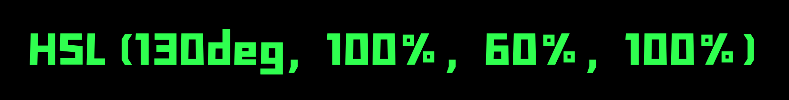

CSS HSL 颜色及变量

import BVideo from "@site/src/components/BVideo";

<BVideo src="//player.bilibili.com/player.html?aid=755875529&bvid=BV1E64y1Z79Q&cid=274126519&page=1" bsrc="https://www.bilibili.com/video/BV1E64y1Z79Q/"/>

无论你是做前端开发的还是做设计的，你肯定遇到过需要设置颜色的情况，但是呢你可能只用过类似 #FA10B2 这样的 16 进制的颜色表示法，或者用过 rgb 颜色表示法。这两种都是使用 RGB 红绿蓝 3 个颜色的组合来表示某个颜色，#FA10B2 这样的颜色使用 16 进制的形式，#号后边每两位依次是红、绿、蓝 3 种颜色的色值，取值范围为 00 到 FF，也就是从 0 到 255，数值越大，颜色的亮度和饱和度就越高，同理 rgb() 也是这个顺序，只是使用了 10 进制的数字，另外还有 rgba ，最后的 a 代表透明度，从 0 到 1，值越大越不透明。

## 问题

使用16进制或 rgb 表示颜色会有一个问题，不同的颜色会有完全不同的数值，而大部分的产品颜色都有 3、5 个固定的颜色色值，在它们的基础上，会改变一些亮度和饱和度来产生和谐的颜色组合，或者是后边发现有的颜色不好看时，可能只会改改色值，而不会改变亮度和饱和度规则。这种情况下，如果使用 rgb，那么每次修改颜色的时候，都要把所有相关的颜色系列全部都改了。另外也没有办法使用 css 变量定义可复用的 rgb 颜色系列。那么应该怎么办呢？

## 解决方案

CSS 中的颜色表示法还有一种是使用 hsl。在了解它之前先看一下它是如何表示颜色的，来看一下颜色色谱：


色谱中的不同颜色叫做色值（或色相，英文为 Hue，从 0 度开始，代表红色，然后到 360 度可以表示所有颜色，例如 120 度表示绿色，180 度代表青色。hsl 颜色表示法中的 h 表示的就是色值，只需要大概清楚颜色在色谱中的大概位置，就能通过度数推断出大概是什么颜色。s 表示的是 saturation，饱和度，饱和度越高颜色越艳丽，饱和度越低则颜色越来越淡，饱和度的值使用百分比表示，取值范围为 0% 到 100% 。l 表示 lightness，亮度，取值范围为 0% 到 100%，色盘中的亮度默认是 50%，这时的颜色是最纯正的，超过 50% 会越来越亮直到所有颜色都变为白色，而如果为 0% 则全部颜色就变成了黑色。使用 hsl 可以在确定颜色之后，只改动饱和度和亮度就可以定义同系列的颜色，而当颜色发生变化但饱和度和透明度不变时，只需要改动色值就可以了。

在 CSS 中使用 hsl() 函数表示 hsl 颜色，它接收 4 个参数，一个是 hue 色值，一个是 saturation 饱和度，一个是 lightness 亮度，最后是一个是 alpha 透明度，取值范围也是 0% 到 100%。

例如定义一个色值：

```
hsl(130deg, 100%, 60%, 100%);
```

h 为 130 度，接近绿色，饱和度为 100%，颜色最为充足，亮度 60%，会让颜色稍浅一点，透明度为100%不透明。它的最终结果就是这样的颜色：



这 4 个参数都是可变的，所以我们可以根据它们的取值范围来定义一些 CSS 变量，这样就可以在整个界面中使用统一的颜色了，而且改起来特别方便。假设我们的网站需要 3 种颜色，分别是绿色、蓝色和紫色，那么我们可以先定义 hue，色值：

```
:root {
  --color-green: 130deg;
  --color-blue: 200deg;
  --color-purple: 250deg;
}
```

然后每种颜色的透明度、亮度和饱和度都各有 5 种变体，那么可以先把这 5 种变体的变量定义出来：

```
--opacity-100: 100%;
--opacity-80: 80%;
--opacity-70: 70%;
--opacity-50: 50%;
--opacity-30: 30%;

--lightness-60: 60%;
--lightness-40: 40%;
--lightness-30: 30%;
--lightness-20: 20%;
--lightness-10: 10%;

--saturation-100: 100%;
--saturation-80: 80%;
--saturation-70: 70%;
--saturation-50: 50%;
--saturation-30: 30%;
```

这里透明度的级别是从100% 到 30%，亮度是从 60%到 10%，饱和度是从 100%到 30%。那么，基于这些变体，可以对每种颜色生成不同的颜色实例。假设绿色有 5 种不同透明度的变体，那么可以定义成这样：

```
--green-opacity-100: hsl(
  var(--color-green),
  var(--saturation-100),
  var(--lightness-60),
  var(--opacity-100)
);
--green-opacity-80: hsl(
  var(--color-green),
  var(--saturation-100),
  var(--lightness-60),
  var(--opacity-80)
);
--green-opacity-70: hsl(
  var(--color-green),
  var(--saturation-100),
  var(--lightness-60),
  var(--opacity-70)
);
--green-opacity-50: hsl(
  var(--color-green),
  var(--saturation-100),
  var(--lightness-60),
  var(--opacity-50)
);
--green-opacity-30: hsl(
  var(--color-green),
  var(--saturation-100),
  var(--lightness-60),
  var(--opacity-30)
);
```

这里，绿色的色值 hue、饱和度saturation、亮度 lightness 是固定的，透明度则依次降低，那么它最终生成的颜色，类似于是这样的：


那么对于蓝色和紫色也可以组合不同的饱和度、亮度、透明度来生成各自的系列颜色，可以改变其中的一种，也可以改变多种。如果在后期改变颜色时，例如使用更偏蓝一点的绿色，只需要把 --color-green 变量的值改大一点就可以了，例如 160deg，这样它会根据这个新的色值，生成相同 5 个透明度级别的颜色变体。对于饱和度、亮度和透明度，也是同样的方式。

好了，现在你学会了新的颜色表示法，是不是觉得使用这种方式更容易理解了？而且对于有设计规范的项目就更有帮助了，可以通过定义变量实现只需要改动一个地方就能改变全局的颜色。如果觉得视频有帮助请三连，想优雅的学前端请关注峰华前端工程师，感谢观看！