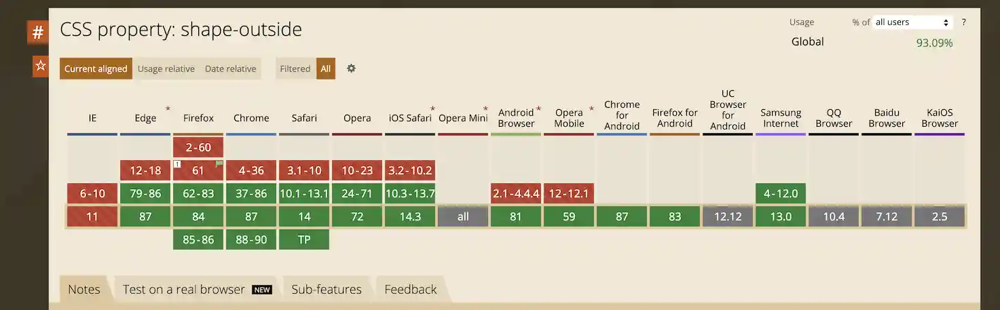

import BVideo from "@site/src/components/BVideo";

<BVideo src="//player.bilibili.com/player.html?aid=501568042&bvid=BV1jN411R7iy&cid=293299086&page=1"/>

都说写网页跟写 word 文档类似，那么 word 文档可以设置图片和文字的环绕方式，CSS 可以吗？

## 解决方法

当然可以。假设有这样的 HTML 页面结构：

```html
<main>
  <h1>百度百科 JavaScript</h1>
  <article>
    
    <p>
      JavaScript（简称“JS”）
      是一种具有函数优先的轻量级，解释型或即时编译型的编程语言。虽然它是作为开发Web页面的脚本语言而出名，但是它也被用到了很多非浏览器环境中，JavaScript
      基于原型编程、多范式的动态脚本语言，并且支持面向对象、命令式和声明式（如函数式编程）风格。JavaScript在1995年由Netscape公司的Brendan
      Eich，在网景导航者浏览器上首次设计实现而成。因为Netscape与Sun合作，Netscape管理层希望它外观看起来像Java，因此取名为JavaScript。但实际上它的语法风格与Self及Scheme较为接近。JavaScript的标准是ECMAScript
      。截至
      2012年，所有浏览器都完整的支持ECMAScript5.1，旧版本的浏览器至少支持ECMAScript
      3标准。2015年6月17日，ECMA国际组织发布了ECMAScript的第六版，该版本正式名称为ECMAScript
      2015，但通常被称为ECMAScript 6 或者ES6。
    </p>
  </article>
</main>
```

`<article>` 元素的语义是代表一篇文章，里边分别加载了一张图片和一段文字，默认图片和文字是上下排列的。如果想让图片靠左对齐，文字段落沿着图片的边界进行环绕，需要进行这些设置：

- 给 img 标签设置 float: left，让它浮动到左边，此时图片的边界是个矩形区域，文字会规整的进行环绕。
- 下边重点来了，给 img 标签设置一个 shape-outside 属性，它是用来自定义图片的边界的，可以使用 css 中的 circle()、 ellipse()、polygon() 或 path() 来绘制圆形、椭圆、多边形或路径边界，另外它还支持使用自定义图片，根据图片的有颜色的部分来确定边界。

那么这里我们就使用同样的图片来设置边界，使用 url() 加载相同的图片作为 shape-outside 属性值：

```
img {
  shape-outside: url(./undraw_static_assets_rpm6.svg);
}
```

然后再设置一下边距和偏移，把图片调整到合适的位置：

```
img {
  margin: 0 2rem;
  transform: translateX(-2rem);
}
```

这个属性和 IE....就不用我说了吧？



这样就实现了图片和文字的环绕效果，示例代码可以从视频简介中的 github 仓库地址找到。如果觉得视频有帮助请三连，想优雅的学前端，请关注峰华前端工程师，感谢观看！