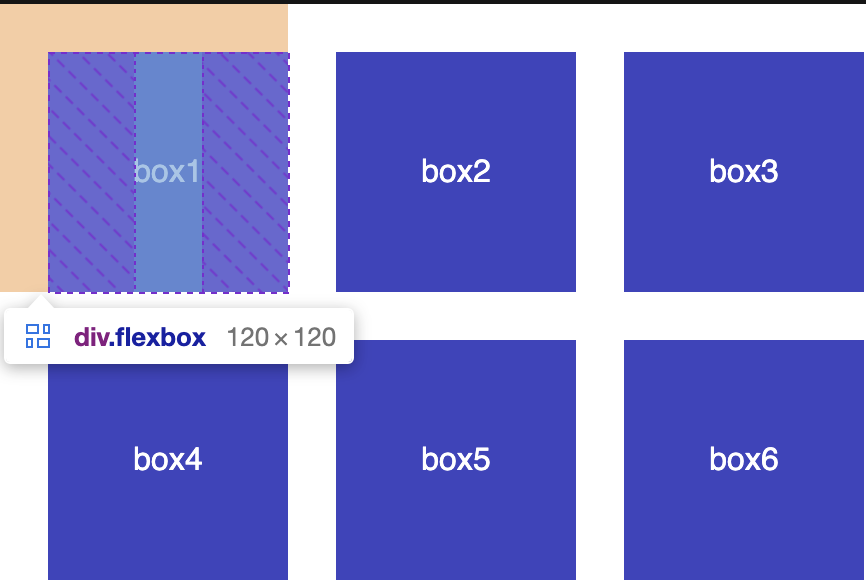
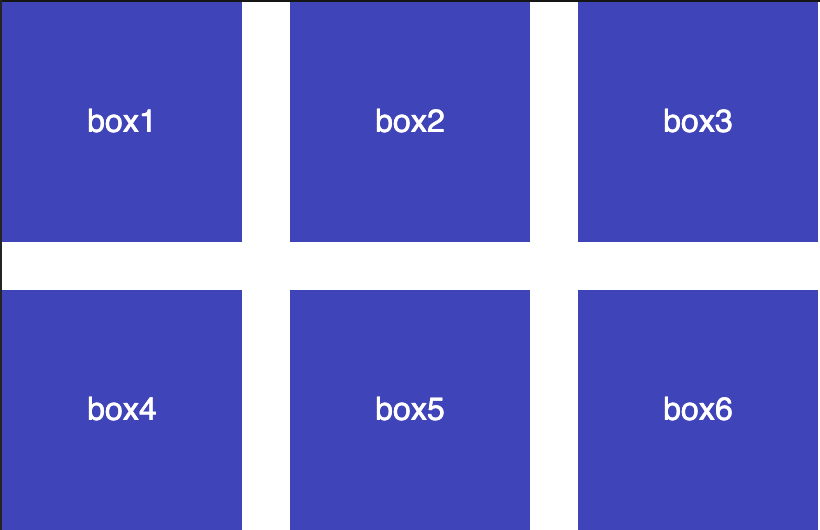

import BVideo from "@site/src/components/BVideo";

我们知道 css grid 布局有 gap 属性，可以让行和列之间有同样的空隙，但是有的时候我们并不需要使用 grid 布局，而是只想对一行，或者是一列元素，调整它的间距，如果在 flex 下也能使用 gap 就好了。事情还就是这么的蹊跷，在最新的 css 规范中，gap 属性也可以用在 flex 布局里边了，那么在正式介绍 gap 属性之前，我们先看一下以前是怎么用 flex 来设置元素的间距的。

## margin 方式

在以前，使用 flex 布局一般通过 `margin`  来设置边距，而且需要考虑换行的情况，也就是设置 `flex-wrap`  为 `wrap`  的情况下，下一行的元素会紧贴着上一行的元素，要是想给这两行元素同时设置列间距或行间距的话，那么需要设置上边距和左边距：

```css
.flex-container {
  display: flex;
  flex-wrap: wrap;
}

.flexbox {
  margin: 24px 0px 0px 24px;
}
```

这样就会有一个问题，使用 `margin`  设置边距，根据边距的位置，第一个或最后一个元素会有多余的边距：



## gap 方式

这时，使用 gap 属性可以避免这种情况，我们可以直接像 css grid 布局中一样，给 flex 布局设置一个 `gap`  属性，比如说 24 像素，那么 flex 布局下边的每个元素之间，就会有一个 24 像素的空隙，它的两边也不会有多余的边距。并且，如果有折行的话，每行之间也会有同样的间距：

```html
<main>
  <div class="flex-container">
    <div class="flexbox">box1</div>
    <div class="flexbox">box2</div>
    <div class="flexbox">box3</div>
    <div class="flexbox">box4</div>
    <div class="flexbox">box5</div>
    <div class="flexbox">box6</div>
  </div>
</main>
```

```css
.flex-container {
  gap: 24px;
}
.flex-container {
  display: flex;
  flex-wrap: wrap;
  gap: 24px;
}
```



## 兼容性

不过，这个属性也是最近才在主流浏览器里面实现。IE11 仍然是不支持的，如果针对 IE 11 调整兼容性，可以继续使用 `margin` ，在每个 flex 元素里边设置上边距和左边距，再给整体的 flex 容器设置负向的边距来把多余的边距给抵消掉，比如说我们这里边，每个 flex 元素都设置了上边距和右边距，为 24 像素， 给 flex 容器设置上边距和左边距为 -24 像素，那么这个效果就跟设置 gap 属性是一样的：

```css
.flex-container {
  margin: -24px 0px 0px -24px;
}

.flexbox {
  margin: 24px 0px 0px 24px;
}
```

不过这里面要注意，不要用右边距和下边距，这样的话在右边会有多余的空间出来，会出现横向滚动条。
还有一个更好的办法，这个 24 像素我们在多个地方用到了它，可以把它放到一个 css 变量里边，比如说叫 `--gutter` ，我们把 24 替换成变量，注意变量前面不能加负号，可以直接用 calc() 函数进行计算，使用 0px 减去它，或者用 -1 乘以它，这样的话，就能够得到 -24 像素：

```css
.flex-container {
  --gutter: 24px;
  margin: calc(0px - var(--gutter)) 0px 0px calc(0px - var(--gutter));
}

.flexbox {
  margin: var(--gutter) 0px 0px var(--gutter);
}
```

好了，在 flex 布局里面使用 gap 属性，是不是也方便多了呢？grid 和 flex 这两种布局可以结合使用，它们都有各自的优点和用处，在开发中按需进行使用就好了。这个就是本节课的内容，你学会了吗？如果有帮助请三连，想学更多有用的前端开发知识，请关注峰华前端工程师，感谢观看！
