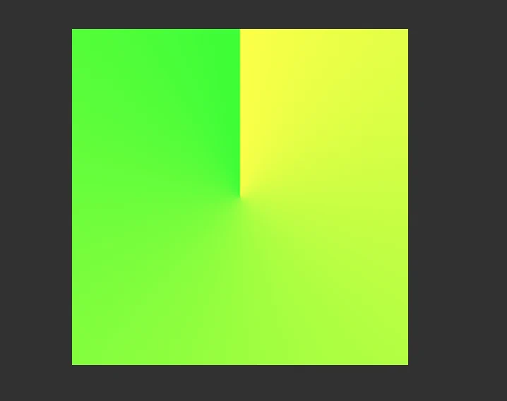
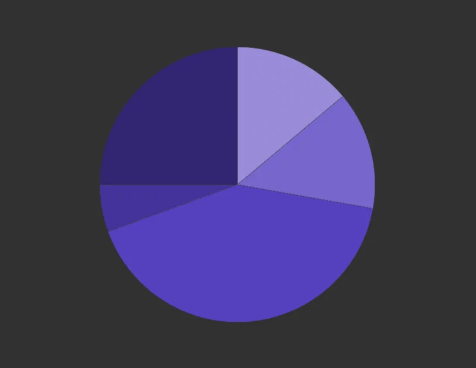

import BVideo from "@site/src/components/BVideo";

在 css 里面设置渐变常用的有两种方式，一个是 linear-gradient 线性渐变，还有一个 radial-gradient 辐射渐变。线性渐变是从一条直线方向上，把一个颜色过渡到另一个颜色，辐射渐变是从一个区域的中心开始，向外扩散，从一个颜色过渡到另一个颜色。CSS 里边还有一个不太常用的渐变： conic-gradient，圆锥渐变。

## 简单的例子

conic-gradient 的过渡方式与 radial-gradient 辐射渐变类似，也是从一个区域的中心开始，但是过渡方式为围绕中心一周，从一个颜色过渡到另一个颜色。比如说有这么一个例子，在 html 里边定义了一个 div，class 为 conic，然后给它设置一下样式，宽高都是 300 像素，border-radius 设置为 50%，把它改成圆形，背景使用 conic-gradient，生成圆锥渐变，这个函数它接受了两个颜色参数，一个是 yellow 黄色，一个 green 绿色，然后它生成的效果就是这样的：



右边是黄色，然后左边是绿色，这样从黄到绿，顺时针转一圈。看到这个两个颜色结合的地方，是一个比较硬的过渡，也就是一个明确的分界线：

```html
<style>
  .conic {
    width: 300px;
    height: 300px;
    border-radius: 50%;
    background: conic-gradient(yellow, green);
  }
</style>
<body>
  <div class="conic"></div>
</body>
```

## 画饼图

利用这种明确的分界线，我们可以用 conic-gradient() 画一个饼图：在同一个位置设置两个不同的颜色，这样两个颜色间就没有了过渡。把上边的例子改一下：

```html
<style>
  .pieChart {
    width: 200px;
    height: 200px;
    border-radius: 50%;
    background: conic-gradient(
      hsl(250, 50%, 70%) 0deg 50deg,
      hsl(250, 50%, 60%) 50deg,
      100deg,
      hsl(250, 50%, 50%) 100deg,
      250deg,
      hsl(250, 50%, 40%) 250deg,
      270deg,
      hsl(250, 50%, 30%) 270deg
    );
  }
</style>
<body>
  <div class="pieChart"></div>
</body>
```

这里假设饼图有五个部分，用相近的五个颜色来表示，那么每种颜色按照一定比例占据饼图的一部分。使用 conic-gradient() 的时候，除了直接指定颜色，还能指定颜色所占的区域，用角度来表示。因为使用的是相近的颜色，那么我们这里使用 hsl() 颜色表示法，使用同一个颜色色相，每部分使用不同的亮度，颜色后边的两个参数一个是开始角度，一个是结束角度，比如说第 1 个颜色用的是 hsl(250, 50%, 70%) 0deg 50deg，他的起始角度是 0 度，结束角度是 50 度，第 2 个颜色起始角度是 50 度，跟第 1 个颜色的结束角度是一样，这样的话它们就有一个明确的分界，没有过渡了，后面的颜色也都是这样设置，最后就可以画出来这样一个紫色的饼图：



这里我们也可以利用 CSS 变量生成一组不同颜色的饼图：

```html
<style>
  body {
    display: grid;
    grid-template-columns: 1fr 1fr;
    gap: 48px;
  }
  .pieChart {
    --hue: 250;
    width: 200px;
    height: 200px;
    border-radius: 50%;
    background: conic-gradient(
      hsl(var(--hue), 50%, 70%) 0deg 50deg,
      hsl(var(--hue), 50%, 60%) 50deg 100deg,
      hsl(var(--hue), 50%, 50%) 100deg 250deg,
      hsl(var(--hue), 50%, 40%) 250deg 270deg,
      hsl(var(--hue), 50%, 30%) 270deg
    );
  }

  .pieChart1 {
    --hue: 240;
  }
  .pieChart2 {
    --hue: 230;
  }
  .pieChart3 {
    --hue: 220;
  }
  .pieChart4 {
    --hue: 0;
  }
  .pieChart5 {
    --hue: 10;
  }
  .pieChart6 {
    --hue: 20;
  }
  .pieChart7 {
    --hue: 80;
  }
  .pieChart8 {
    --hue: 90;
  }
</style>
<body>
  <div class="pieChart pieChart1"></div>
  <div class="pieChart pieChart2"></div>
  <div class="pieChart pieChart3"></div>
  <div class="pieChart pieChart4"></div>
  <div class="pieChart pieChart5"></div>
  <div class="pieChart pieChart6"></div>
  <div class="pieChart pieChart7"></div>
  <div class="pieChart pieChart8"></div>
</body>
```

我们在 html 中编写 8 个饼图结构，然后在基础样式的基础上再加上自己单独的样式，pieChart 1 到 8，分别用于调整变量的值。在 CSS 中，我们把色相单独拿出来，在 .pieChart 的样式中定义为 --hue，值为 250，把 conic-gradient() 中 hsl 的第一个参数改为使用这个变量。接着，在每个饼图单独的样式中，随机修改一下 --hue 的数值，这样就可以生成一组不同颜色的饼图，可以作为一些装饰性的元素或背景，这种不太适合制作真实的饼图，因为作为背景的图片对于外部的可访问性不好。

## 制作色盘

我们还可以利用 conic-gradient() 画一个色盘，因为色盘也是从 0~360 度，均匀的分布了所有的颜色。我们可以把之前饼图的例子简单的改一下，把颜色按照 45 度一级，给它排列开，从 0~360 度，这样的话，它就能变成一个色盘了：

```html
<style>
  .colorwheel {
    width: 200px;
    height: 200px;
    border-radius: 50%;
    background: conic-gradient(
      hsl(0deg, 100%, 50%),
      hsl(45deg, 100%, 50%),
      hsl(90deg, 100%, 50%),
      hsl(135deg, 100%, 50%),
      hsl(180deg, 100%, 50%),
      hsl(225deg, 100%, 50%),
      hsl(270deg, 100%, 50%),
      hsl(315deg, 100%, 50%),
      hsl(360deg, 100%, 50%)
    );
  }
</style>
<body>
  <div class="colorwheel"></div>
</body>
```

这个就是使用 css 制作饼图和色盘的过程，利用了一个比较小众的 conic-gradient 圆锥渐变，它是围绕区域中心对颜色进行过渡的方式，利用它我们可以制作很多有创意的图形和装饰元素。你学会了吗？如果有帮助三连，想学更多有用的前端开发知识，请关注峰华前端工程师，感谢观看！
