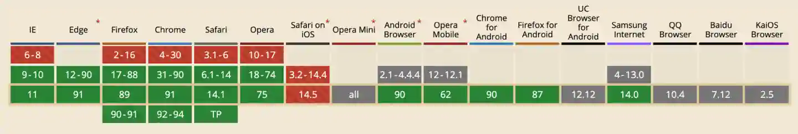

import BVideo from "@site/src/components/BVideo";

<BVideo src="//player.bilibili.com/player.html?aid=846008180&bvid=BV1A54y1G7iR&cid=352829983&page=1"/>

在前端这个无奇不有的世界里，有些网站不是正常垂直滚动的，而是横向滚动的，那么在没法把鼠标滚轮横过来的前提下（苹果除外），能否实现网页横向滚动呢？我们来写代码试试。

先看一下最终效果，这里我用鼠标的滚轮垂直滚动，页面是横向滚动的。

<Codepen title="JS 实现鼠标滚轮横向滚动特效" hash="KKWyxja" />

要实现这个功能，只需要一点点的 JS 代码。

## 编写 HTML 结构

先看一下 HTML 结构，很简单，就是三个模拟全屏页面的 div，class 都是 page，然后放在一个 class 名为 container 的 div 容器中：

```html
<main>
  <div class="container">
    <div class="page">Page1</div>
    <div class="page">Page2</div>
    <div class="page">Page3</div>
  </div>
</main>
```

## 编写 CSS 样式

对于样式，container 容器设置为 flex 布局，并且显示横向滚动条：

```css
.container {
  display: flex;
  overflow-x: scroll;
}
```

里面每一个页面元素的宽高都设置为占满浏览器可视区域的 100%，并且在 flex 布局中，不自动收缩，再分别给他们设置不同的背景色，用于区分：

```css
.page {
  width: 100vw;
  height: 100vh;
  flex-shrink: 0;
}

.page:nth-child(1) {
  background: hsl(140deg, 50%, 50%);
}

.page:nth-child(2) {
  background: hsl(210deg, 50%, 50%);
}

.page:nth-child(3) {
  background: hsl(270deg, 50%, 50%);
}
```

## 实现横向滚动

接下来我们使用 JS 实现横向滚动，首先获取 container 容器：

```javascript
let container = document.querySelector(".container");
```

给它添加一个 "wheel" 事件，这个是监听鼠标滚轮的滚动，在滚动时，先阻止默认的滚动事件，然后让容器水平横向移动，这里利用到了 scrollLeft 属性，让容器的内容向左移动，这里只需要加上滚轮垂直滚动的距离差值就可以了，也就是 event 对象中的 deltaY 属性：

```javascript
container.addEventListener("wheel", (event) => {
  event.preventDefault();
  container.scrollLeft += event.deltaY;
});
```

## 兼容性

wheel 事件的兼容性可以参考 caniuse 提供的数据：




## 总结

这样就实现横向滚动了，重点是利用了 "wheel" 事件监听鼠标滚轮滚动，然后获取滚动距离差值，把它加到可以滚动的容器的 scrollLeft 属性中，你学会了吗？如果有帮助请三连，想学更多有用的前端开发知识，请关注峰华前端工程师，感谢观看！

## 源码

Github: [https://github.com/zxuqian/html-css-examples/tree/master/38-horizontal-scrolling](https://github.com/zxuqian/html-css-examples/tree/master/38-horizontal-scrolling)

import Codepen from "@site/src/components/Codepen";