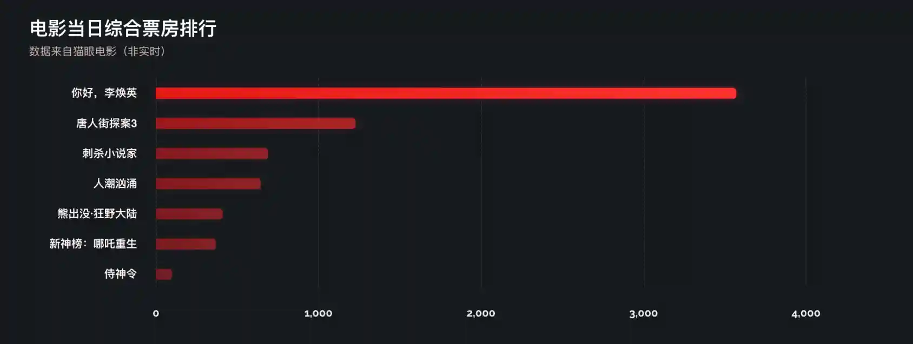

数据可视化已经成为前端发展的一个重要的方向了，利用大数据可以预测趋势、行为。那么数据在进行计算出来之后，最重要 的一步就是进行展示，不展示出来，再好的数据也没说服力。

import BVideo from "@site/src/components/BVideo";

<BVideo src="//player.bilibili.com/player.html?aid=799924670&bvid=BV14y4y1b7tU&cid=318765309&page=1"/>

这个视频就看一下，如何利用咱们上期封装好的 Vue Echarts 组件，来展示一下电影票房柱状图的实现过程。先看一效果：



这里的数据是过年期间从猫眼电影里获得的，只取了排名靠前的几部电影，展示它们当日的综合票房数据。柱状图是横向表示的，y 轴为分类，也就是电影的名字，按票房由高到低排序。x 轴为票房数值，并显示分隔线。柱子为渐变的红色，并且越靠下透明度越低。鼠标移上去的时候，柱子会高亮显示，并且把其它的柱子变暗，同时在右侧显示当前柱子代表的数值。
因为前几期视频介绍了如何使用 Vite 创建 Vue3 的项目（==插入视频弹幕==），并且封装了 Echarts 组件，那么这里我们就看一下柱状图的配置。

## 准备数据

首先来准备示例数据，从猫眼电影获取的数据放到了 public/boxOffice.json 文件中，后面可以直接使用 /boxOffice.json 这个路径来模拟加载远程数据：

```javascript
fecth("/boxOffice.json");
```

文件里是 json 格式的数据，结构为：存放了对象的数组，对象中 name 为电影名，boxOffice 为票房：

```json
[
  {
    "name": "你好，李焕英",
    "boxOffice": 3570.68
  },
  {
    "name": "唐人街探案3",
    "boxOffice": 1228.29
  },
  {
    "name": "刺杀小说家",
    "boxOffice": 690.94
  },
  {
    "name": "人潮汹涌",
    "boxOffice": 644.34
  },
  {
    "name": "熊出没·狂野大陆",
    "boxOffice": 409.9
  },
  {
    "name": "新神榜：哪吒重生",
    "boxOffice": 368.5
  },
  {
    "name": "侍神令",
    "boxOffice": 98.75
  }
]
```

## 加载数据

再来加载数据，打开 App.vue，在 js 代码中：

- 定义一个 boxOfficeData Ref，它是一个数组，用来保存加载的远程票房数据，默认为空。
- 接着定义 fetchData 函数，它是 async 的，因为我们需要请求服务器，这是一个耗时的操作。
- 在 fetchData 里边使用 fetch() 请求数据，这里把我们的模拟数据路径传递给它，它会默认以 GET 方式请求数据。
- 之后使用 res.json() 来把获取的数据转换为 JavaScript Object，这里是个数组。
- 最后把结果放到 boxOfficeData 这个响应式的 ref 中。

加载数据的操作推荐在组件挂载之后，所以使用 onMounted() 生命周期，在里边调用 fetchData()。这些内置的函数别忘了导入进来。

```javascript
import { onMounted, ref, watchEffect } from "vue";

const boxOfficeData = ref([]);

const fetchData = async () => {
  const res = await fetch("/boxOffice.json");
  const data = await res.json();
  boxOfficeData.value = data;
};

onMounted(() => {
  fetchData();
});
```

## 创建柱状图组件

现在来创建柱状图组件。上一步获取到的数据会通过属性传递给柱状图组件，我们在 src/components 下新建一个 BarChart.vue 文件，在里边编写组件代码。首先看 JavaScript 部分：

- 这个组件要接收票房数据来展示，使用 defineProps() 来指定要接收的属性，boxOfficeData，它是数组类型。
- 为了保证在使用对象解构语法后，其中的属性仍然是响应式的，我们使用 toRefs 把 props 中所有的属性转换为 Ref。
- 之后根据 boxOfficeData 来生成图表配置，我们使用 computed() 来让票房数据发生变化时，自动更新图表配置。
- 在 computed() 里边，使用自定义的 populateMovieData() 函数来把票房原始数据变换成 echarts 需要的数据格式。
- 把返回的结果传递给 barChartOptionCreator()，这个就是用于生成图表配置的，稍后再看它的代码。

这里的 populateMovieData() 函数会接收原始票房数据，然后把电影名和票房数值分开，分别保存到单独的数组中。因为 echarts 的坐标轴类别和数值是分开的。

```javascript
import Chart from "./Chart.vue";
import barChartOptionCreator from "../charts/barChart.js";
import { computed, defineProps, toRefs } from "vue";

const props = defineProps({
  boxOfficeData: Array,
});

const { boxOfficeData } = toRefs(props);

const options = computed(() => {
  const { names, boxOffices } = populateMovieData(boxOfficeData.value);
  return barChartOptionCreator(names, boxOffices);
});

function populateMovieData(rawData) {
  let names = [];
  let boxOffices = [];
  rawData.forEach((movie) => {
    names.push(movie?.name);
    boxOffices.push(movie?.boxOffice);
  });

  return { names, boxOffices };
}
```

在 template 中，使用之前封装好的 echarts 组件，把 options 属性传递给它：

```javascript
<template>
  <!-- 如果只有一个顶层标签，:class=$attrs.class 可以省略 -->
  <Chart :options="options" :class="$attrs.class" />
</template>
```

这里注意，:class="$attrs.class" 是说如果其它组件用到这个组件时，该把 class 属性传递给谁，不过当 template 中只有一个组件时可以省略。

## 配置柱状图

（左边放代码，右边放图演示）
接下来我们看下柱状图的配置，在 src/charts 目录下新建一个 barChart.js 文件，在里边：

- 导出一个函数，函数接收 categories 和 data 两个参数，分别是坐标轴分类和数据，也就是之前传递的电影名和票房。
- title 属性定义了图表的标题、副标题、标题样式（有文字大小和颜色），以及副标题的样式。
- grid 属性定义了图表的整个网格的样式，分别设置了左、右、下、上的偏移，可以是具体数值也可以是百分比。containLabel 是说在计算偏移时，是不是要把坐标轴的文本算进去，这里设置为 true，计算进去，防止因偏移不够而导致文本显示不全。
- xAxis 用于设置 x 坐标轴，type 设置它的类型为 value，数值型，因为我们的柱状图是横向的，x 轴是数据。然后设置分隔线 splitLine 样式为虚线、灰色，以及坐标轴文本 axisLabel 字体样式。
- yAxis 设置 y 坐标轴，类型为 category 类别型，取值为传递进来的 categories 参数，即电影名，设置反向排序，数值大的靠上，不显示坐标线和刻度线，再设置坐标文本字体样式。
- series 就是设置图表了，由于我们没显示图例，所以 name 是可选的，这里设置为综合票房，但是它不会显示，类型设置为柱状图，数据为传递进来的 data 参数，即票房。设置柱子最大宽度为 14。
- 我们稍后再看 emphasis。下面的 itemStyle 是设置柱子的样式的，每根柱子都是由深红到浅红的渐变色，那么使用 color 属性，把 type 设置为 linear 就成为了线性渐变，x、y、x2、y2 设置渐变区域，取值为 0 - 1，即百分比，colorStops 则设置渐变区域的颜色，这里 0% 为深红，100%为浅红。
- 接着通过 borderRadius 设置圆角，shadowBlur 和 shadowColor 分别设置柱子阴影模糊半径和颜色。
- 配置完 series 后，设置图表背景色为透明。
- 我们可以看到柱状图的颜色从上到下会越来越暗，这是因为根据数据的不同，颜色的透明度也不同，数据值越小的，透明度越低（即更透明），除了手动计算数值和透明度的映射外，我们还可以通过 VisualMap 来设置。
- VisualMap 是一个组件，但我们只是单纯的用 VisualMap 来计算映射值，不需要显示它，所以设置 show 为 false，然后最小值为 0，最大值为 3600，数据维度为第 1 维，然后用 inRange 属性设置映射到的透明度，为 0.3 到 1。也是是说票房区间设置为 0 到 3600，然后映射到透明度就是 0.3 到 1。这样就配置好了。
- 最后看一下 emphasis，这个是配置鼠标移动到柱子上时的高亮样式，这里设置它自己为焦点，会把其它柱子变暗，然后在高亮的柱子的右侧显示 label，并设置 label 的样式，同时把柱子的渐变色再调亮一些，作为高亮样式。最后把阴影调大，让它有浮动的感觉。

```javascript
// 导出一个函数，方便未来添加自定义属性
export default (categories = [], data = []) => {
  return {
    title: {
      text: "电影当日综合票房排行",
      subtext: "数据来自猫眼电影（非实时）",
      textStyle: {
        fontSize: 24,
        color: "hsl(0deg, 100%, 100%)",
      },
      subtextStyle: {
        fontSize: 14,
        color: "hsl(0deg, 20%, 75%)",
      },
    },
    grid: {
      left: "3%",
      right: "4%",
      bottom: "3%",
      top: 80,
      containLabel: true,
    },
    xAxis: {
      type: "value",
      splitLine: {
        lineStyle: {
          type: "dashed",
          color: "#333",
        },
      },
      axisLabel: {
        fontWeight: "bold",
        color: "#eee",
        fontSize: 14,
        fontFamily: "Raleway",
        margin: 24,
      },
    },
    yAxis: {
      type: "category",
      data: categories,
      inverse: true,
      axisLine: {
        show: false,
      },
      axisTick: {
        show: false,
      },
      axisLabel: {
        fontWeight: "bold",
        color: "hsl(0deg, 100%, 98%)",
        fontSize: 14,
        margin: 24,
      },
    },
    series: [
      {
        name: "综合票房",
        type: "bar",
        data: data,
        barMaxWidth: 14,
        emphasis: {
          focus: "self",
          label: {
            show: true,
            position: "right",
            color: "hsl(0deg, 100%, 60%)",
            fontSize: 14,
            fontWeight: "bold",
          },
          itemStyle: {
            color: {
              type: "linear",
              x: 0,
              y: 0,
              x2: 1,
              y2: 1,
              colorStops: [
                {
                  offset: 0,
                  color: "hsl(0deg, 100%, 60%)",
                },
                {
                  offset: 1,
                  color: "hsl(0deg, 80%, 60%)",
                },
              ],
            },
            shadowBlur: 24,
          },
        },
        itemStyle: {
          color: {
            type: "linear",
            x: 0,
            y: 0,
            x2: 1,
            y2: 1,
            colorStops: [
              {
                offset: 0,
                color: "hsl(0deg, 80%, 50%)",
              },
              {
                offset: 1,
                color: "hsl(0deg, 100%, 60%)",
              },
            ],
          },
          borderRadius: [0, 4, 4, 0],
          shadowBlur: 8,
          shadowColor: "hsl(0deg, 100%, 50%, 0.3)",
        },
      },
    ],
    backgroundColor: "transparent",
    visualMap: [
      {
        show: false,
        min: 0,
        max: 3600,
        dimension: 0,
        inRange: {
          opacity: [0.3, 1],
        },
      },
    ],
  };
};
```

## 使用柱状图组件

在配置完柱状图后，我们在 App.vue 中使用它（记得导入）：

- 把 BarChart 组件放到 class 为 wrapper 的 div 容器中。
- 把 boxOfficeData 传递给它，并添加一个 chart class 样式。

```html
<template>
  <div class="wrapper">
    <BarChart :boxOfficeData="boxOfficeData" class="chart" />
  </div>
</template>
```

样式里主要设置了背景色和容器的布局。容器使用 grid 布局，把图表放到中间，这里设置为了两行，是为了给下期视频的环形图留出空位，最后再设置柱状图的宽高：

```css
* {
  box-sizing: border-box;
  margin: 0;
  padding: 0;
}

body {
  background: hsl(210deg, 20%, 10%);
}

.wrapper {
  display: grid;
  grid-template-rows: 1fr 1fr;
  width: 100vw;
  height: 100vh;
  align-items: center;
  justify-items: center;
}
.wrapper .chart {
  width: 80%;
  height: 400px;
}
```

## 预览效果

运行 yarn dev 来看一下效果，这个就是我们最终配置的柱状图。

## 总结

在这个视频中，我们作了这些操作：

- 准备示例票房数据。
- 在 App.vue 中获取票房数据并传递给 barChart 组件。
- barChart 组件根据原始票房数据，构建 echarts 所需要的数据。
- 创建自定义的柱状图配置。
- 设置柱状图样式。

好了，这个就是使用 echarts 自定义柱状图展示票房数据的过程，你学会了吗？如果有帮助，请三连，想更好的学前端，请关注峰华前端工程师，感谢观看！
