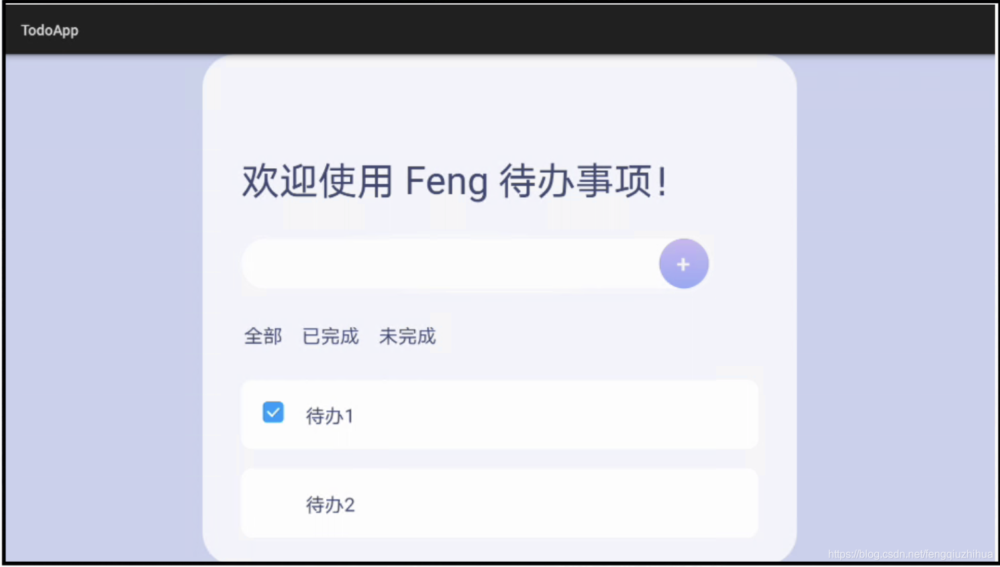
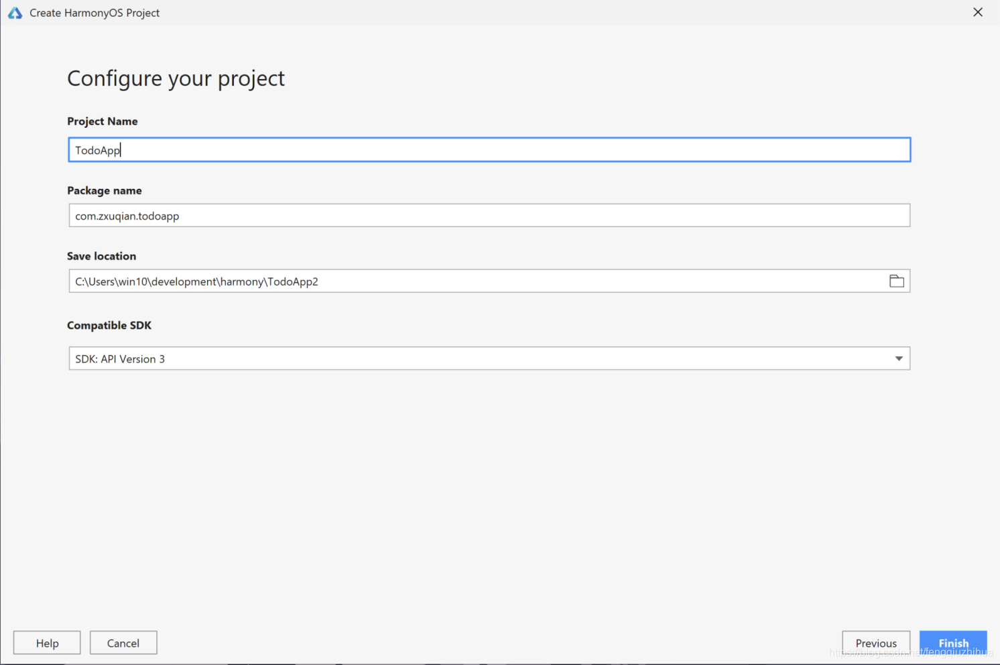
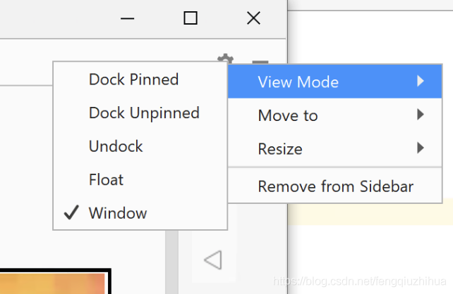
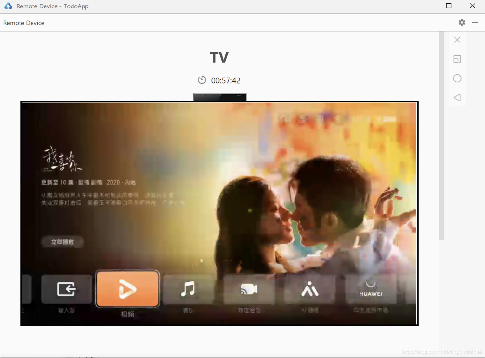

import useBaseUrl from '@docusaurus/useBaseUrl';

距离鸿蒙 OS 2.0 发布已经过去一些日子了，看到鸿蒙系统强大的设备共享能力，我觉得未来它一定能够成为主流的操作系统。在利用了分布式系统的优势之后，多个设备间可以共享应用程序界面和数据，并且对于开发者，也可以使用一套代码编写应用，就可以在多种设备终端上运行。

一开始我并没有太关注鸿蒙系统，以为它只能使用 Java 开发应用，跟前端好像没啥关系，但是看了开发文档后，发现 UI 部分既支持纯 JavaScript 开发，也支持纯 Java 开发，还可以 Java 跟 JavaScript 混合开发。鸿蒙应用的开发跟 Android 的开发很像，只是把概念重新定义了一下。它分为 FA（Feature Ability）和 PA（Particle Ability）两种应用模式，FA 是带有用户界面的，PA 则是运行在后台的服务程序，可以想象成安卓里的 Activity 和 Service，不过也略有不同。FA 支持使用 Java 和 JavaScript 两种方式开发 UI 界面。如果使用 Java，则跟 Android 一样，使用 xml 定义布局或者 Java 代码定义布局，每个页面都是一个 PageAbility，使用 Java 编写业务代码，不同的页面之间传递数据依然使用 intent。而这里如果使用 JavaScript UI 框架的话，那么写法跟 Vue 应用基本一模一样，同样支持 data、props、computed、watch 和 functions（methods），也能创建自定义的组件，这样 web 前端工程师就很容易转型成为鸿蒙 UI 开发工程师，不得不说华为在已有概念上做的整合，还是相当厉害的。

<!-- truncate -->

## 项目介绍

在了解了鸿蒙可以使用 JavaScript 开发之后，那么这里我就给大家展示一下前端惯例项目，Todo App 的开发过程。这篇文章将只先介绍 UI 的开发过程，因为这部分所遇到的坑就能产生足够多的篇幅了。这个作品是一个 TV 版的应用，因为鸿蒙暂时不支持移动 App 的开发，它的最终效果如下图所示（模拟器分辨率较低，图的质量不太好）：




项目 Github 地址：[https://github.com/zxuqian/harmonyos-examples](https://github.com/zxuqian/harmonyos-examples)

这个项目简单的展示了一个 Todo 列表，整体容器背景为淡紫色，todo 列表中有应用的标题，添加 todo 的输入框和按钮，过滤选项，以及 todo 列表。因为鸿蒙貌似不支持改变 checkbox 的背景颜色，未选中状态是白色，跟 todo 列表容器的背景是一样的，所以看不到，选中之后则可以看到是默认的蓝色。因为这个设计稿原本是给手机界面设计的，而鸿蒙 TV 只支持横向滚动条，所以这个界面看起来会有点奇怪，不过不影响我们学习项目开发方法。

## 配置开发环境

分析完界面之后，我们来正式进入开发阶段。首先需要下载鸿蒙的 IDE 开发环境，它叫 DevEco Studio，可以从以下链接下载，下载时需要注册华为账号：

DevEco Studio：[https://developer.harmonyos.com/cn/develop/deveco-studio](https://developer.harmonyos.com/cn/develop/deveco-studio)

由于使用 JavaScript 开发项目，所以本地还需要安装 Node.js 的运行环境，可以从下边链接下载：

Node.js：[https://nodejs.org/en/](https://nodejs.org/en/)

有了这些工具，开发环境就配置好了。接下来，我们创建一个基于 JavaScript 的 TV 项目。

## 创建项目

打开 DevEco，在欢迎界面中选择 Create HarmonyOS Project，然后在 Choose your ability template 界面中，Device 下选择 TV，Template 选择 Empty Feature Ability(JS) 创建一个空的 JS 项目。


点击 Next，在 Configure your project 界面输入项目信息。在 Project Name 中输入 TodoApp，Package name 我这里使用了 com.zxuqian.todoapp，在 save location 中选择项目的保存路径，Compatible SDK 保持默认就好，填写完成之后点击 Finish 完成项目的创建。



我们先来大体看一下项目的目录结构，这里列出来了关键的目录说明：

```shell
TodoApp
  entry ----------------------- 项目入口，除 entry 外，还可以创建多个 Feature Ability，但只有 entry 是独立的
     src ---------------------- 源代码
       main
         java ----------------- Java 源代码
         js   ----------------- JS 源代码
           default
             common ----------- 公共组件
             i18n   ----------- 国际化
             pages  ----------- 页面
               index ---------- 首页文件夹
                 index.css ---- 首页 css 样式
                 index.hml ---- 首页 hml 结构
                 index.js ----- 首页 js 数据绑定代码
             app.js ----------- JS 项目入口
         resources ------------ 静态资源文件，图片、视频等
         config.json ---------- 鸿蒙项目配置
       test ------------------- 测试代码
  gradle** -------------------- Java 依赖管理工具配置
```

## 运行项目

然后可以运行项目看一下效果。因为项目需要运行在模拟器中，所以得在 DevEco Studio 中创建一个 TV 模拟器，这里需要注意的是，鸿蒙的模拟器是远程桌面的方式进行访问，所以需要先认证华为开发者账号。要创建模拟器，在 Tools 菜单中选择 HVD Manager：


然后会打开浏览器，显示华为开发者登录页面，用华为账号登录进去之后，选择个人或公司认证，填写银行卡后认证成功。认证完成之后要**关闭浏览器，**因为浏览器在打开状态下，无法在 DevEco 中登录，这应该是个 Bug。再次选择 Tools -> HVD Manager，在弹出的浏览器页面中登录并授权后，就可以看到模拟器了：


选择 TV，然后点击 Actions 下的三角形就可以启动成功了。默认浏览器是内嵌在 DevEco Studio 中的，可以点击右上角的齿轮图标，在弹出菜单中选择 View Mode -> Window 来让它以窗口形式显示。



另外，因为是远程的模拟器，所以画质不好，并且每次只能使用 1 小时，超时后需要重新启动：



模拟器启动成功后，就可以启动项目了。点击工具栏中的三角形按钮，确保下拉选择框选择了 entry：


稍后就能在模拟器看到示例的 “你好，世界” 字样了。

## 编写 HML 部分

现在开始 Todo App 的开发，先编写页面结构。这里注意不是 HTML，而是 HML，并且文件名也是 hml 结尾。因为鸿蒙的运行环境并不是浏览器，所以不支持原生的 html 标签，虽然有些标签名字一样，但那些只是鸿蒙为了便利开发者而定的，底层实现完全不一样，它们会转换成原生的鸿蒙控件，当然它也有特殊的 hml 标签，方便进行布局。语法上，除了一些 html 属性不支持外，其他都一样。这一点，跟 React Native 的原理是一样的。鸿蒙支持的标签可以查看 API 文档：

[HML 组件 API 文档](https://developer.harmonyos.com/cn/docs/documentation/doc-references/js-components-container-div-0000000000611484)

另外鸿蒙开发过程中，不支持保存页面实时刷新，需要手动重启项目，这个确实有点棘手，就希望以后会完善吧。另外编写代码后不用保存，这个倒是有点不习惯。

要编写 Todo App 结构，打开 js/default/pages/index/index.hml 文件，删掉里边的示例代码，首先最外层容器，即背景容器，使用 div 表示，class 名字为 main：

```html
<div class="main"></div>
```

接下来是 Todo App 应用的容器，使用 class 名字为 container 的 div 表示：

```html
<div class="main">
  <div class="container"></div>
</div>
```

在 container 里边，使用 text 标签显示标题，hml 中所有的文字都使用 text 标签表示：

```html
<text class="h1">欢迎使用 Feng 待办事项！</text>
```

接下来是添加 todo 项目的输入框和按钮，这部分跟 html 一样：

```html
<div class="input-add">
  <input type="text" />
  <button>+</button>
</div>
```

再下面是过滤选项，除了文字使用 text 表示之外，也跟 html 一样：

```html
<div class="filters">
  <text class="filter"> 全部 </text>
  <text class="filter"> 已完成 </text>
  <text class="filter"> 未完成 </text>
</div>
```

最后是 todo 列表，这里写死了两个待办事项，后面我们会把它的数据重构到 js 文件中。这里选择使用了 div 来显示 todo 列表，也可以使用 list 和 list-item，不过我个人觉得 list 适合整个页面是个列表页的情况，或者列表数据特别多的情况，你也可以自己尝试一下，不过记得使用 background-color 和 box-shadow 去掉 list 的背景和阴影。Todo 列表的 hml 结构代码如下：

```html
<div class="todo-list">
  <div class="todo-item">
    <input type="checkbox" />
    <text>待办1</text>
  </div>
  <div class="todo-item">
    <input type="checkbox" />
    <text>待办2</text>
  </div>
</div>
```

hml 结构到这里就写完了，接下来编写 CSS 样式。

## 编写 CSS 部分

鸿蒙中的 CSS 与普通的 CSS 还是有一些区别的，有些属性用法不同，并且不同的标签对于 CSS 属性的支持程度也不一样，可以参考 HML 部分中提到的 API 文档。在鸿蒙 TV 项目中，容器默认是 flex 布局，并且 flex-direction 为 row，行方向，这个需要注意一下。

打开 index.css，我们先给 text 标签设置默认的文本颜色，因为我们的应用是浅色，而鸿蒙的主题为深色，所以文本为白色，这样就看不到了，而且我也没找到如何修改默认主题，这个你可以研究一下～。text 标签的 css 代码如下：

```css
text {
  color: #414873;
}
```

接下来设置最外层容器的样式，这里的 css 与普通的没什么区别：

- 把 Todo App 容器居中
- 背景色设置为淡紫色

```css
.main {
  justify-content: center;
  background-color: rgb(203, 210, 240);
}
```

再设置 Todo App 容器的样式

- 设置宽度、内间距、阴影、圆角边框。这里要注意，圆角边框的值不能是百分比。
- 设置背景色只能使用 background-color，不能使用 background 简写形式，background 只能用来设置 linear-gradient 渐变色，如果设置背景图，则需要使用 background-image。
- 最后把 flex 的方向改成列方向，竖向排列。

```css
.container {
  width: 60%;
  padding: 48px 28px;
  box-shadow: 0px 0px 24px rgba(0, 0, 0, 0.15);
  border-radius: 24px;
  background-color: rgb(245, 246, 252);
  flex-direction: column;
}
```

容器的第一行，是标题，我们设置一下它的外边距、文字大小，我们这里把 flex-shrink 设置为 0，因为 TV 版不支持竖向滚动条，放的内容多了之后就会互相挤占空间（解决方法是在设计界面的时候该改成横向式布局，甩锅设计师～），这里就用禁止缩放来做为临时解决方法，这个不是重点：

```css
.h1 {
  margin: 24px 0;
  font-size: 28px;
  flex-shrink: 0;
}
```

标题下方是添加 todo 项目的输入框和按钮，首先给它们的容器设置相对定位，垂直居中对齐子元素：

```css
.input-add {
  position: relative;
  align-items: center;
  flex-shrink: 0;
}
```

对于输入框，设置一下它的大小，内间距，文字大小等，这里把它 z-index 设置为 5，因为后边的添加按钮要覆盖在它的上边：

```css
.input-add input {
  padding: 24px 52px 24px 18px;
  border-radius: 48px;
  box-shadow: 0px 0px 24px rgba(0, 0, 0, 0.08);
  width: 100%;
  font-size: 24px;
  align-items: center;
  justify-content: center;
  color: #626262;
  z-index: 5;
}
```

按钮的样式：

- 设置为圆形
- 使用 background 设置渐变的背景色
- 设置+号文本为白色，文字大小为 18px
- 向左移动 36px，紧贴输入框的右边框
- 设置 z-index 为 10，来覆盖在输入框上边。

```css
.input-add button {
  width: 36px;
  height: 36px;
  border-radius: 18px;
  background: linear-gradient(#c0a5f3, #7f95f7);
  color: white;
  font-size: 18px;
  left: -36px;
  z-index: 10;
}
```

剩下的过滤选项和 todo 列表的 CSS 就没什么特殊的了，可以参考文章开头提供的、完整的源代码实现。另外要注意的是，这里的 CSS 不支持 before 和 after 伪元素，因为毕竟不是原生的 html，无法创建虚拟的 dom。

## 编写 JS 部分

我们的过滤选项和 Todo 列表中的数据可以从 JS 中获取，在 JS 中定义好数据，然后在 hml 中访问，这里的语法和方式跟 Vue 一样。

打开 index.js 文件，删除 data 中的示例数据和示例的生命周期函数，然后添加过滤选项需要的数据 filters，和 todo 列表中的数据 todos：

```javascript
data: {
  title: ""
    filters: ["全部", "已完成", "未完成"],
    todos: [{id: 1, content: "待办1"}, {id: 2, content: "待办2"}]
},
```

接着打开 index.hml 文件，把 filters 中的 text 删掉 2 个，剩下的一个改成：

- 使用 for 指令遍历 data 中的 filters 数据，并且给每个元素命名为 filter
- 设置 tid， 相当于 Vue 中的 key，用于列表数据渲染性能优化，这里直接使用\$idx，数组的索引，{{}}用来获取变量的值
- 然后内容则是 filter 变量中的值，使用 {{filter}} 获取。

```html
<text class="filter" for="{{filter in filters}}" tid="{{$idx}}">
  {{filter}}
</text>
```

接下来，删掉一个 todo-item 的示例，同样的改成循环渲染：

- 这里的 tid 直接使用 todo 中的 id，可以直接使用 todo 中的 id 属性名字
- 然后在 text 中使用 todo 中的 content 属性值

```html
<div class="todo-item" for="{{todo in todos}}" tid="id">
  <input type="checkbox" />
  <text>{{todo.content}}</text>
</div>
```

好了，现在代码就编写完成了，可以运行一下看一下最终效果，和开头的图片如果是一样的话，那么就成功了。

## 总结

这篇文章给如何编写鸿蒙 JS 项目提供了入门的指导，里边要涉及的内容还有很多，比如编写自定义的组件，使用@system/fetch 等系统组件加载远程数据等，这些一篇博文讲下来内容会比较多，所以后期会再继续更新进阶一点的教程。在编写完这个示例项目之后，发现鸿蒙的发展前景还是很大的，融合了当下最流行的应用开发方式，这样对于它的生态发展很有帮助，开发者的学习成本低，工作量也低，一套代码就可以在 TV、手表、PC、手机上运行，有着相当好的开发体验。希望随着系统和完善，有朝一日终成为主流的操作系统。

最后总结下，通过本文你应该掌握了：

- 配置开发环境并添加模拟器。
- 鸿蒙中的 hml 、css ，js 的语法、用法和一些要注意的坑。
- 成功运行 Todo TV 项目。

如果觉得教程有帮助，请点赞并关注，我是峰华，感谢！

扫码关注公众号：


