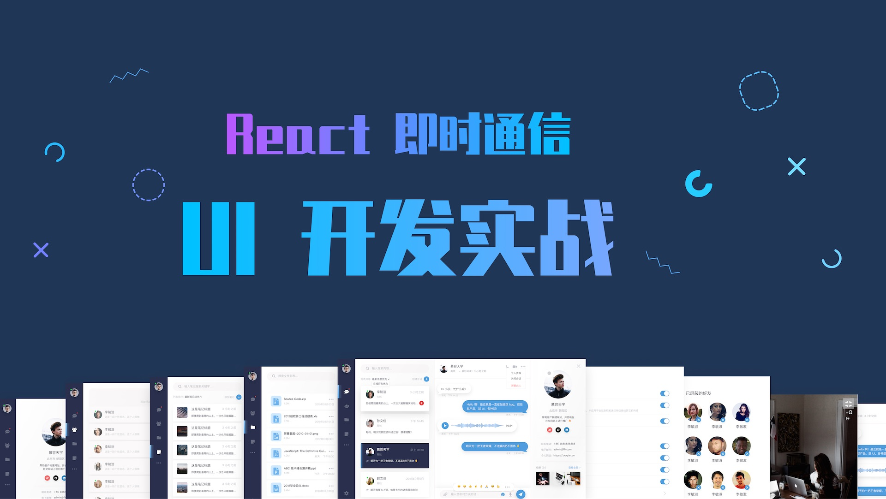

import styled from "styled-components";

<Purchase />

export const Purchase = styled(({ ...props }) => {
  return (
    

      <a
        href="https://ke.qq.com/course/2839093?tuin=3850fdc6"
        className={`button button--primary`}
      >
        腾讯课堂
      </a>
      <a
        href="https://study.163.com/course/courseMain.htm?courseId=1210022809&share=2&shareId=480000002172128"
        className={`button button--success`}
      >
        网易云课堂
      </a>
      <a
        href="https://chat-ui-course.vercel.app/"
        target="_blank"
        className={`button button--info`}
      >
        查看示例
      </a>
    

  );
})`
  display: grid;
  gap: 12px;
  grid-template-columns: repeat(3, min-content);
  @media (max-width: 400px) {
    grid-template-columns: 1fr;
  }
`;

## 为什么选这门课？

如果你是一名前端工程师或者是正在学习前端，苦于没有完整的项目经验，也没有人系统的指导你该如何开发一个前端项目，那么你一定非常希望有一套课程来为你指点迷津，并且在课程结束后能收获开发思路、项目经验和发展方向 —— 这就是这门课的目的。
市面上大多数的课程都围绕电商、企业官网、后台管理来做项目实战。而本课程不同的是：以即时通信应用 UI 组件库和示例页面作为切入点，全面的演示了一套完整的 UI 库的实现过程，课程结束后，不但可以增加项目经验，扩充作品集，还可以在此基础上扩展为应用到各行各业的 UI 库，就像 Ant Design 和 Element UI。
这门课程以 React 为核心技术框架，为什么选择了 React 而不是用的人数比较多的 Vue 呢？因为：

- React 更接近于原生的 HTML，相当于自定义 HTML 标签，入门更容易。
- React 编写的代码简洁，让开发者只关心组件的定义和状态的管理，其他像组件的注册都由 React 自行管理。
- React 的用户量庞大，生态系统完善，很多开发理念都是围绕 React 产生的，比如 CSS-in-JS，GraphQL。
- React 在国内大型企业应用广泛，掌握 React 开发的工程师求职更有竞争力。

## 学完本课程你将能够...

- 熟练使用 React 及其生态开发 UI 组件
- 培养组件化的设计与开发思维
- 开发可复用的组件，提升开发效率
- 了解企业协作开发的方式

## 你将学到...

- React + Hooks 真实案例开发
- Styled-Components 强大的组件样式管理
- Storybook 组件文档化，方便团队协作
- React Router 路由控制
- React Spring 动画实现
- React 组件设计思想
- 设计思维
- 以及更多

## 课程包括

- 1 整套通用的 React UI 组件库
- 30+ 常用组件
- 5 个示例即时通信页面
- 源代码
- 图片素材

## 课程不包括

课程重点关注前端 UI 组件化设计思路，打造自有前端 UI 库，类似 Ant Design, 所以下列内容不包含在本课程中（考虑后续课程推出）：

- Redux 数据流管理
- 后端即时通信业务逻辑

## 面向人群

需要拥有扎实的 HTML、CSS、JS 基础了解 React 基本概念（属性，状态）（非必需）
如果你没有 React 基础，也能够学会 HTML+ CSS 实现常见的 UI 组件。如果你是 UI 设计师可以帮助你更好的跟前端工程师沟通

## 课程目录

- 课程介绍
  - 项目演示
  - 课程简介
- 环境配置
  - 安装 Node.js
  - 安装 VS Code 和插件
  - 安装 yarn（可选）
  - 创建 React 工程
  - React 快速回顾
  - styled-components 简介与配置
  - Storybook 简介与配置
- 组件开发
  - 组件与页面规划
  - 导航栏
    - 头像组件
    - jsconfig.json 文件介绍
    - hygen 模板代码生成器配置
    - 图标组件
    - 徽章组件
    - 菜单组件
    - 侧导航组件
  - 消息列表
    - 搜索框组件
    - 排版组件
    - 下拉菜单组件 - 过滤
    - 按钮组件
    - 过滤选项组件
    - 消息卡片组件
    - 消息列表页面组件
  - 会话列表
    - 标题栏组件
    - 会话气泡组件
    - 语音气泡组件
    - Emoji 组件
    - Popover 组件
    - 底部操作组件
  - 个人资料
    - 个人资料&头像组件
    - 个人信息部分
    - 社交信息部分
    - 分隔线组件
    - 联系信息部分
    - 相册组件
    - 关闭按钮组件
  - 设置页面
    - InputText 组件
    - Select（表单）组件
    - Radio 组件
    - Switch 组件
    - 个人资料-设置页
    - 编程个人资料组件
    - 设置项组件
    - 设置页面组件
    - 屏蔽列表组件
  - 其他列表组件
    - 抽离过滤列表组件
    - 联系人卡片组件
    - 文件列表组件
    - 笔记列表组件

* 其他组件
  - 视频通话组件
  - Dropdown 组件
  - 组装聊天首页
* 路由管理
  - React Router 介绍
  - 配置导航路由
  - 配置内容区域路由
* 创建动画
  - React Spring 介绍
  - Staggered Animation 配置
  - 抽离动画为自定义的 Hooks
  - 导航切换过渡动画
  - 会话窗口动画
  - 个人资料抽屉动画
  - 设置页面动画
* 示例数据（静态）
  - 添加示例数据
* 项目总结
  - 总与回顾
