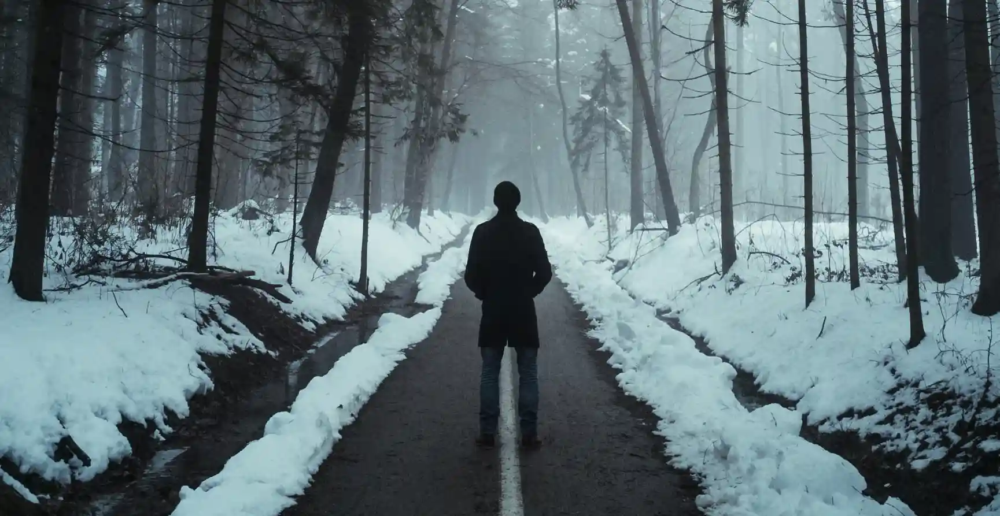

今天是成为 Bilibili Up 主的第 513天，也是这个网站上线”随笔“栏目的第一天，为什么不专心于技术而写这些乱七八糟的呢？原因是，做技术类视频或写技术类文章，需要搜集资料，整理，消化，吸收，撰写文章或视频文案，做视频的话，后面还要做 PPT，录声音，录屏幕，找素材，剪辑，发布，都是耗费巨大精力和时间的事情，而随笔写作可以吐槽一些不满、压力，想写什么就写什么，是一个放松的过程，还可以把我的想法说给你听，了解我做 UP 主的背后，都经历了什么。

## 这是一段孤独的旅程

我本打算一直在北京做视频，因为前同事、同学还有一些朋友都在北京，平时聚一聚也很方便。2019 年底回家过年，疫情来了，我以为过段时间还能回到北京，于是就没退房子，后来发现可能短时间没法回去了，就在疫情放松的时候把房子退掉了，从此开启了在老家做 UP 主的旅程。

<!-- truncate -->

一开始回来，可能对家乡的发展和变化有很多的新鲜感，所以并没啥失落或孤独的感觉，即使这里除了家人和家人的朋友外，我已经没有任何熟悉的朋友和同学了（这里离北京很近，他们大部分去北京发展了）。只是，在家待的时间过的飞快，到现在已经一年半了，伴随而来的孤独感、无聊感已经悄悄的影响了我的生活和效率。

以前，我像是打了鸡血似的可以从早忙到黑，现在就想天天躺着刷手机，工作一小时，休闲两小时，特别没有效率，有时候能准备 3 篇内容的时间，只能产出 1 篇来，这种因为压力导致的低效，又反过来增加了压力，觉得没有成就感，把光阴虚度了。

还有就是北京的朋友们，也越来越疏远了，可能因为不能时常见到，而我朋友本来就少，每当失去一个朋友，都像从身上割下一块肉。从事程序员这个行业本身就很少需要和人打交道，慢慢的交朋友的能力也就丢掉了，交新朋友是难上加难，有时候晚上夜深人静的时候，那种孤独感包围着的感觉不好受。

## 那么，以上都是问题吗？

是，也不是。从事哪个工作都有难处，而 UP 主，或者说内容创作者，还有其它所有一个人创业的来说，这条路上的难处更多是被孤立的感觉。这种感觉会持续伴随着整个奋斗的过程，影响着心情、效率和健康，从这个方面来讲确实是一个问题，会打击人的信心和斗志。

但是既然选择了一条不同寻常的路，就要承受这个孤单的旅程，人虽然是社会性动物，但是有时候为了社交而强行和不懂自己、不支持自己的人交朋友，会更耗费精力，倒不如把关注点转移到自己正在奋斗的事业上。再有，孤独这种不良情绪造成的工作效率降低，这种也只是暂时的，并且与当时的健康状况、饮食和睡眠都有关系，并不是因为只身一人导致的，因为其它大部分时间还是好的，人的情绪本身就跟股市一样，有起有落，这是常态。

另外，几乎所有有所成就的人，都承认，在实现自己的目标之前，会有一段非常孤独的旅程，面对众人的不理解和看不到的未来，有多次想放弃的念头，但是挺过去，就成功了。所以，从这些方面看，也都不是问题，而是一种必定要经历的状态。

## 接下来要怎么做？

放弃么？当然不！面对以上这些问题，找到根源，逐个解决，让一个人奋斗的路上，少点崎岖。对于情绪上的问题，我发现运动能解决 99%，每次跟着健身 APP 练完，或者在公园散步之后，都会感觉自己的身体轻了一半，还会有莫名的愉悦感，那种状态是真的很好。另外还要睡够，每次熬夜后，第二天我肯定会情绪低落，做事没效率，完了晚上还不甘心，不想睡，报复性熬夜，要解决这个问题，只能强迫自己早睡喽。

关于孤独感和社交，因为其实每天都有和家人交流，基本上已经保证社交需求了，而找朋友、对象啥的，还是个长期的工作，不能急，既然不急，那么就不该把关注点放到这里，有时候就是太爱钻牛脚尖，把一个芝麻大小的问题，放大几千万倍，跟天塌了似的，等熬过这段时间又会觉得当时自己的状态很可笑，还是把关注点放到怎么实现自己的梦想上吧，其它的可以放一放。

## 写在最后

第一次公开自己的想法，虽然害怕别人的评价，但是有评价才会有交流，有交流才会有思想的火花，有火花才能给自己前进的方向。为了不影响网站的专业度，所以把这部分博客放到了二级菜单隐蔽的入口，如果你想认识我，了解我，愿意听我说说话，欢迎你常来！