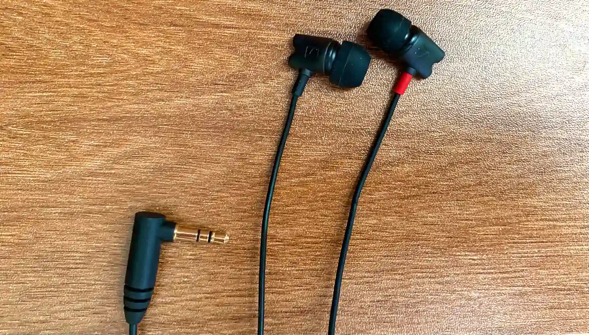

手里的 Bose Sports 耳机已经跟随了我有六七年的历史了，纯白的耳机和线已经成了黢黑的，洗都洗不掉，一千多大洋买的，真舍不得换。后来想看看万能的某宝有没有高质低价的耳机，然后发现了这个四百多价位的，diy 的，著名的森某牌的耳机。

由于第一次买，心里也是有点唐突，自己也不是专业人士，不能鉴定音质的好坏，店家说不是原装音质可以退货，于是心一横下单买了，收到货后发现做功还是不错的，耳机线没有塑料感，耳机头跟原装很像。

<!-- truncate -->

来试试音质，这里就不管什么专业术语了，也不是专业的人，就以我个人的主观感受来说吧。最近一段时间迷上了拉丁歌曲，都是适合随曲舞动的，所以节奏感比较强，重低音也比较多，在用这款耳机播放时，对比以前的 Bose 耳机，发现：

- 每种乐器和人声分的更清楚了，不再是杂糅在一起的感觉。
- 整体音质有提升，像是撤掉了一层纱窗，也像是近视眼加上了眼镜的感觉，音乐更加通透。
- 音乐里的乐器的方位也能清楚的判断，有空间感，不是直接集中在脑门部位。
- 低音方面，一般听大街上那种大喇叭，会感觉心脏被震了，而这个耳机也有感觉，不过毕竟是入耳式的耳机，力度不能和头戴式或音响比较。
- 高音这个耳机做的十足，高音乐器听的清清楚楚，高音鼓点也很清脆。
- 人声感觉是这耳机最有特色的部分了吧，原装也是主打人声，就像在耳边说话，很清晰。

大概属于比较均衡的耳机，当然，也是有一些缺陷的：

- 低音稍稍有些不足，不太适合对重低音要求特别高的歌曲，但已经比我以前的耳机好太多了。
- 高音对于我来说有点过了，不太喜欢清脆和刺耳的乐器（因人而异）。
- 耳机头略微大一点点，我耳道比较小、特殊，戴一阵软化了可能会好点，或者直接换个小的。
- 没有线控，可有可无的东西，也不算缺陷，就先放到这里吧。

总之对于这个 400 多的价位，真的是物超所值了，如果有机会去体验一下原装的是什么音质。现在可以淘汰以前的 Bose 了，如果有需要的小伙伴，可以从[这个链接看看（无推广）](https://item.taobao.com/item.htm?spm=a1z09.2.0.0.53c52e8dtfKlbW&id=628341487170&_u=r3in614fb93)，数量是有限的，毕竟（据描述）用的是原厂的单元。

本文纯属个人体验感受，仅做参考，不给商家背书。
